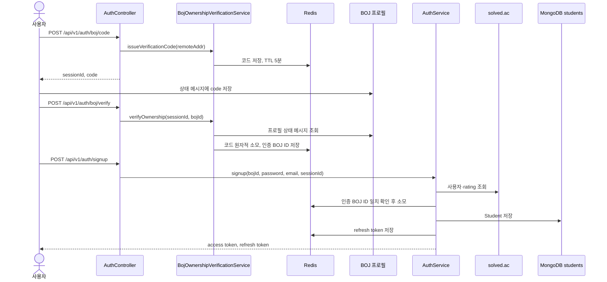

# BOJ 소유권 인증과 회원가입

## 목적

BOJ ID를 입력했다는 사실만으로 계정을 만들지 않고, 사용자가 해당 BOJ 프로필의 상태 메시지를 수정할 수 있는지 확인한 뒤 가입한다.

현재 동작하는 가입 경로는 `BOJ 인증 코드 발급 → 프로필 확인 → /signup`이다. `POST /api/v1/auth/signup/finalize`는 `410 Gone`을 반환하는 중단된 경로이므로, OAuth 신규 가입 마무리를 현재 제공 기능으로 보지 않는다.

## 실제 요청과 저장 위치

| 요청 | 진입 메서드 | 저장 위치 |
| --- | --- | --- |
| `POST /api/v1/auth/boj/code` | `AuthController.issueBojVerificationCode` | Redis에 인증 코드와 만료 시간 저장 |
| `POST /api/v1/auth/boj/verify` | `AuthController.verifyBojOwnership` | 기존 코드를 소모하고 Redis에 인증된 BOJ ID를 5분간 저장 |
| `POST /api/v1/auth/signup` | `AuthController.signup` | MongoDB `students`, Redis refresh token |

Access token은 응답으로 반환하며 서버에 별도 저장하지 않는다.

## 요청 흐름

## 코드 경로

1. `AuthController.issueBojVerificationCode`는 연결 원격 주소를 식별자로 넘긴다.
2. `BojOwnershipVerificationService.issueVerificationCode`는 분당 5회 제한을 확인하고 UUID 세션과 `DIDIM-LOG-` 형식의 코드를 만든다.
3. `JsoupBojProfileStatusMessageClient.fetchStatusMessage`는 `https://www.acmicpc.net/user/{bojId}`를 읽는다. `BojVerificationCodeMatcher`는 단순 부분 문자열이 아닌 코드 경계까지 확인한다.
4. `BojOwnershipVerificationService.verifyOwnership`는 Redis의 원래 코드를 `consume`으로 한 번만 사용하고, 세션에 인증된 BOJ ID를 연결한다.
5. `AuthService.signup`은 `registerBojAccount`로 이어진다. 비밀번호 정책과 BOJ ID·이메일 중복을 확인하고, `SolvedAcClient.fetchUser` 결과로 rating과 tier를 계산한다.
6. BCrypt 비밀번호를 포함한 `Student`를 `StudentRepository.save`로 저장한 뒤 JWT와 refresh token을 발급한다.

주요 구현 파일:

- `ui/controller/AuthController.kt`
- `application/auth/boj/BojOwnershipVerificationService.kt`
- `infra/boj/JsoupBojProfileStatusMessageClient.kt`
- `infra/boj/RedisBojVerificationCodeStore.kt`
- `application/auth/AuthService.kt`
- `domain/Student.kt`

## 데모 fixture 경계

`portfolio-fixture`이면서 `prod`가 아닐 때만 `PortfolioBojProfileStatusMessageClient`와 `PortfolioSolvedAcClient`가 활성화된다.

- 인증 코드는 `application-portfolio-fixture.yaml`의 고정값을 사용한다.
- BOJ 프로필 조회는 고정 상태 메시지를 반환한다.
- solved.ac 사용자 조회도 고정 사용자 정보를 반환한다.
- Redis 세션 소모, 비밀번호 암호화, MongoDB 학생 저장, 토큰 발급 경로는 실제 코드와 같다.

운영 프로필에서는 fixture가 활성화되지 않고 Jsoup BOJ 조회와 solved.ac HTTP 호출을 사용한다.

## 알려진 제약

- BOJ 프로필 HTML 구조와 외부 사이트 접근 가능 여부에 영향을 받는다.
- 코드 발급 제한은 서버가 확인한 연결 원격 주소를 기준으로 한다. 프록시 뒤에서 실제 사용자 주소를 전달하는 계약이 없으면 여러 사용자가 같은 제한을 공유할 수 있다.
- 코드 확인 API에는 세션별 실패 횟수 제한이 없다.
- 인증 세션은 학생 저장 전에 소모된다. MongoDB 저장이 실패해도 세션을 복구하지 않으므로 다시 인증해야 한다.
- Redis 세션 소모와 MongoDB 저장은 하나의 원자적 트랜잭션이 아니다.
- 인증을 통과해 가입해도 생성되는 `Student.isVerified`는 현재 기본값 `false`로 남는다.
- BOJ ID와 이메일을 먼저 조회해 중복을 검사하지만, `Student` 선언에는 두 필드의 유니크 인덱스가 없다. 동시 가입 경쟁을 애플리케이션 조회만으로 완전히 막지는 못한다.
- tier는 solved.ac 응답의 `tier` 필드를 그대로 저장하지 않고 `rating`으로 다시 계산한다.
