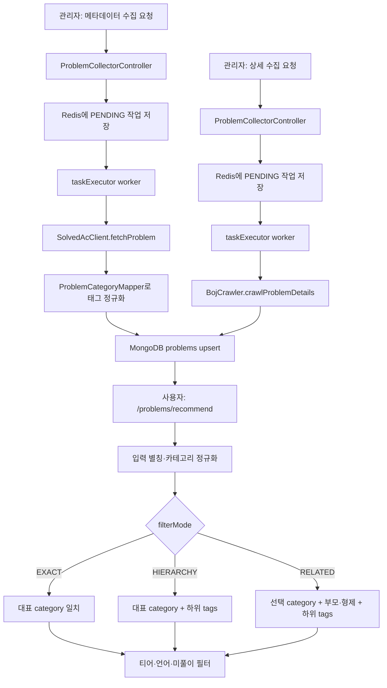

# 문제 수집과 카테고리 검색

## 목적

문제 수집과 카테고리는 별도 기능이 아니라 하나의 메타데이터 흐름이다. solved.ac에서 받은 태그를 수집 단계에서 정규화해 `problems` 문서에 저장하고, 추천 단계가 같은 대표 카테고리와 태그를 `EXACT`, `HIERARCHY`, `RELATED` 정책으로 조회한다.

상세 본문 수집은 이 메타데이터에 BOJ 문제 설명과 예제를 보강하는 후속 작업이다.

## 실제 요청과 저장 위치

| 요청 | 역할 | 저장 위치 |
| --- | --- | --- |
| `POST /api/v1/admin/problems/collect-metadata?start=&end=` | solved.ac 메타데이터 비동기 수집 | MongoDB `problems`, Redis 작업 상태 |
| `GET /api/v1/admin/problems/collect-metadata/status/{jobId}` | 메타데이터 작업 상태 조회 | Redis |
| `POST /api/v1/admin/problems/collect-details` | 상세 HTML이 없는 문제 비동기 수집 | MongoDB `problems`, Redis 작업 상태 |
| `POST /api/v1/admin/problems/refresh-details` | 상세 강제 재수집 | MongoDB `problems`, Redis 작업 상태 |
| `GET /api/v1/problems/recommend` | 카테고리 정책을 적용한 추천 | `problems`, `students` 조회 |
| `GET /api/v1/problems/categories/meta` | 부모·자식·연관 카테고리 메타 조회 | 코드의 정적 계층 정의 |

관리 작업 생성·취소·재시도 기록은 MongoDB `admin_audit_logs`에도 저장한다.

## 전체 흐름

## 코드 경로

### 1. 메타데이터 수집과 정규화

1. `ProblemCollectorController.collectMetadata`가 범위와 관리자 정보를 `ProblemCollectorService.collectMetadataAsync`에 전달한다.
2. 서비스는 Redis에 `PENDING` 작업을 만들고 `taskExecutor.execute`로 worker를 등록한 뒤 `jobId`를 즉시 반환한다.
3. `collectMetadataAsyncInternal`은 번호별로 `SolvedAcClient.fetchProblem`을 호출한다.
4. `ProblemCategoryMapper.extractTagsToEnglish`는 한국어 표시명을 `ProblemCategory`로 변환하고 영문 정식명 목록으로 중복 제거한다.
5. `determineCategory`는 첫 번째 정규 태그를 대표 `category`로 사용한다. 태그가 없으면 `IMPLEMENTATION`이다.
6. 기존 문제는 메타 필드만 복사해 갱신하고, 신규 문제는 BOJ URL을 포함해 `ProblemRepository.save`로 저장한다.
7. 처리 수, 성공·실패 수, 체크포인트는 항목마다 Redis 작업 상태에 반영한다.

### 2. 상세 보강

1. `collectDetailsBatchAsync`는 `descriptionHtml`이 없는 문제를 먼저 조회한다.
2. worker의 `collectDetailsBatchAsyncInternal`이 `BojCrawler.crawlProblemDetails`를 호출한다.
3. `#problem_description`, `#problem_input`, `#problem_output`과 최대 5개의 입출력 예제를 읽어 같은 `problems` 문서에 저장한다.

### 3. 카테고리 추천 검색

1. `ProblemController.recommendProblems`가 `category`, `language`, `filterMode`를 `RecommendationService.recommendProblemsDetailed`에 넘긴다.
2. `AlgorithmHierarchyUtils.findCategoryEnglishName`은 `TagUtils`의 제한된 별칭과 enum 이름·영문명·한글명을 영문 정식명으로 맞춘다.
3. `EXACT`는 `findByLevelBetweenAndCategory`만 호출해 대표 카테고리만 찾는다.
4. `HIERARCHY`는 선택 카테고리의 직접 하위 태그를 `findByLevelBetweenAndTagsIn`의 MongoDB `$in` 조건에 추가한다.
5. `RELATED`는 선택 항목의 부모와 형제를 대상 카테고리에 더한 뒤 각 대표 카테고리와 확장 태그 결과를 합친다.
6. 난이도는 `max(1, tierLevel - 2)..tierLevel + 2` 범위로 제한하고, tier level이 0 이하면 1~2를 사용한다. 이후 언어와 이미 푼 문제를 제외하고 무작위로 요청 개수만 반환한다.
7. `ProblemCategoryViewResolver`는 응답 표시용 `primaryCategory`, `secondaryCategories`, `normalizedTags`를 다시 계산한다.

주요 구현 파일:

- `ui/controller/ProblemCollectorController.kt`
- `application/problem/collector/ProblemCollectorService.kt`
- `infra/solvedac/ProblemCategoryMapper.kt`
- `application/recommendation/RecommendationService.kt`
- `application/utils/AlgorithmHierarchyUtils.kt`
- `domain/repository/ProblemRepositoryImpl.kt`

## 데모 fixture 경계

`portfolio-fixture`이면서 `prod`가 아닐 때 `PortfolioSolvedAcClient`와 `PortfolioBojCrawler`가 외부 호출을 대체한다.

- 1000~1005번은 고정 제목·레벨·태그·상세 본문을 반환한다.
- 그 밖의 번호도 기본 fixture 응답을 반환한다.
- 비동기 executor, Redis 작업 상태, 카테고리 변환, MongoDB 저장과 추천 쿼리는 실제 경로를 사용한다.

운영에서는 `SolvedAcWebClient`와 `BojCrawler`가 실제 외부 응답을 사용한다.

## 알려진 제약

- 항목 하나의 수집 실패는 `failCount`로 기록되지만 전체 작업은 `COMPLETED`가 될 수 있다.
- 취소는 항목 사이에서 상태를 확인하는 방식이라 진행 중 HTTP 호출이나 대기 시간을 즉시 중단하지 않는다.
- 작업 상태는 24시간 TTL이며 서버 재시작 뒤 진행 중 작업을 복구하는 worker는 없다.
- 상태 변경 락은 한 JVM 안에서만 동작해 다중 인스턴스의 동시 갱신을 조정하지 못한다.
- 상세 대상은 worker 실행 전에 목록으로 고정되며, 예제는 최대 5쌍만 수집한다.
- 한국어 표시명이 없는 solved.ac 태그 key도 `fromKorean`에 전달되므로 일부 태그가 `Unknown`으로 합쳐질 수 있다.
- 계층은 코드에 하드코딩된 직접 부모·자식 관계다. `RELATED`는 유사도 검색이 아니라 부모·형제 확장이다.
- `EXACT`는 보조 태그만 일치하는 문제를 찾지 않는다.
- 알 수 없는 카테고리 입력은 오류로 거절하지 않고 빈 결과가 될 수 있다.
- 응답 표시용 대표 카테고리는 별도 우선순위로 계산하므로 저장된 대표 `category`와 다를 수 있다.
