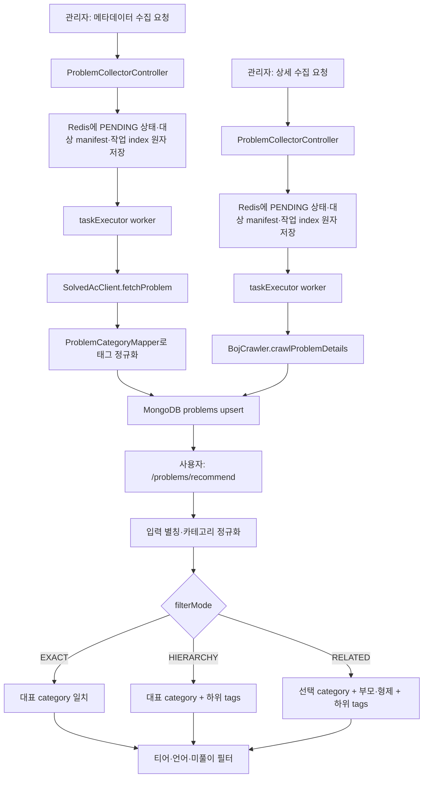

# 문제 수집과 카테고리 검색

## 목적

문제 수집과 카테고리는 별도 기능이 아니라 하나의 메타데이터 흐름이다. solved.ac에서 받은 태그를 수집 단계에서 정규화해 `problems` 문서에 저장하고, 추천 단계가 같은 대표 카테고리와 태그를 `EXACT`, `HIERARCHY`, `RELATED` 정책으로 조회한다.

상세 본문 수집은 이 메타데이터에 BOJ 문제 설명과 예제를 보강하는 후속 작업이다.

## 실제 요청과 저장 위치

| 요청 | 역할 | 저장 위치 |
| --- | --- | --- |
| `POST /api/v1/admin/problems/collect-metadata?start=&end=` | solved.ac 메타데이터 비동기 수집 | MongoDB `problems`, Redis 작업 상태 |
| `GET /api/v1/admin/problems/collect-metadata/status/{jobId}` | 메타데이터 작업 상태 조회 | Redis |
| `POST /api/v1/admin/problems/collect-details` | 상세 HTML이 없는 문제 비동기 수집 | MongoDB `problems`, Redis 작업 상태 |
| `POST /api/v1/admin/problems/refresh-details` | 상세 강제 재수집 | MongoDB `problems`, Redis 작업 상태 |
| `POST /api/v1/admin/problems/jobs/{jobId}/retry` | 종료 작업의 실패 항목·미처리 구간 재시도 | Redis 작업 상태·실패 원장·대상 manifest |
| `GET /api/v1/problems/recommend` | 카테고리 정책을 적용한 추천 | `problems`, `students` 조회 |
| `GET /api/v1/problems/categories/meta` | 부모·자식·연관 카테고리 메타 조회 | 코드의 정적 계층 정의 |

관리 작업 생성·취소·재시도 기록은 MongoDB `admin_audit_logs`에도 저장한다.

## 전체 흐름

## 코드 경로

### 1. 메타데이터 수집과 정규화

1. `ProblemCollectorController.collectMetadata`가 범위와 관리자 정보를 `ProblemCollectorService.collectMetadataAsync`에 전달한다.
2. 서비스는 Redis Lua로 `PENDING` 상태, 대상 manifest와 sorted index를 함께 만든
   뒤 `taskExecutor.execute`로 worker를 등록하고 `jobId`를 즉시 반환한다.
3. `collectMetadataAsyncInternal`은 번호별로 `SolvedAcClient.fetchProblem`을 호출한다.
4. `ProblemCategoryMapper.extractTagsToEnglish`는 한국어 표시명을 `ProblemCategory`로 변환하고 영문 정식명 목록으로 중복 제거한다.
5. `determineCategory`는 첫 번째 정규 태그를 대표 `category`로 사용한다. 태그가 없으면 `IMPLEMENTATION`이다.
6. 신규·기존 문제 모두 메타데이터 소유 필드만 MongoDB modifier upsert로 갱신하며, 기존 상세·URL·언어는 보존한다.
7. 처리 수, 성공·실패 수, 체크포인트와 실패 문제 ID는 항목마다 Redis에 함께 반영한다.

상태 변경은 읽은 Redis JSON 원문을 기대값으로 비교하는 Lua CAS로 처리한다. 오래된
worker의 갱신은 반영하지 않으며 `COMPLETED`, `FAILED`, `CANCELLED` 상태는 다시
변경하지 않는다. 실패 ID는 작업별 Set에 24시간 보관하고 상태와 TTL을 맞춘다.
sorted index는 작업을 만들 때 한 번만 기록한다.

대상 manifest는 상태와 별도 Redis String으로 24시간 저장한다. 연속 메타데이터
범위는 `range`, 비연속 메타데이터와 비메타데이터 작업은 실행 순서의 명시 ID로
기록한다. 상태에는 manifest version과 SHA-256 참조만 두며, 상태·manifest·index는
같은 생성 Lua에서 전부 저장하거나 전부 저장하지 않는다.

### 2. 상세 보강

1. `collectDetailsBatchAsync`는 `descriptionHtml`이 없는 문제를 먼저 조회한다.
2. 동일 JVM의 수집 작업이 공유하는 pacer가 BOJ 요청 시작 간격을
   2~4초로 제한한다.
3. 병렬 설정을 켜면 전용 executor가 `BojCrawler.crawlProblemDetails`를
   최대 `K`개씩 실행한다. 기본은 비활성화·`K=1`이다.
4. `#problem_description`, `#problem_input`, `#problem_output`과 최대 5개의
   입출력 예제를 읽는다.
5. 조회가 뒤섞여 완료돼도 coordinator가 대상 manifest 순서로
   MongoDB 부분 갱신과 Redis 진행률·checkpoint를 반영한다.
6. 중간 실패는 문제 ID를 Redis 실패 원장에 남기고 다른 대상을
   계속 처리한다. 추가 대기 결과는 최대 `K`개로 `O(K)`다.

[제한 병렬 수집 설계와 3,400건 측정](../refactoring/be-refactor/PHASE_6N_CRAWLER_DETAILS_BOUNDED_PARALLEL.md)

### 3. 실패 항목 재시도

1. 신규 `COMPLETED` 작업은 전체 대상을 처리했는지 확인하고 실패 원장에 있는
   문제만 manifest 순서로 다시 처리한다.
2. 신규 `FAILED`·`CANCELLED` 작업은 처리 완료 prefix의 실패 문제와
   `processedCount` 이후 manifest suffix를 합친다.
3. 처리 위치의 직전 ID와 checkpoint, 실패 ID와 처리 prefix가 맞는지 확인한다.
4. 비메타데이터 작업은 선택된 ID만 `findAllById`로 조회해 원래 순서로 복원한다.
   원본 작업 뒤 DB에 추가된 문제는 대상에 섞이지 않는다.
5. 실패 문제가 그 사이 삭제됐다면 제외하고 남은 문제를 계속 처리한다.
6. manifest 참조가 있는데 key가 없거나 자료형·hash·JSON·대상 수·처리 위치가
   맞지 않으면 새 작업을 만들지 않고 `409 RESOURCE_STATE_CONFLICT`를 반환한다.
7. manifest가 없는 기존 작업만 원본 범위·checkpoint 또는 현재 조회 가능한
   비메타데이터 대상을 사용하는 종전 경로를 유지한다.

상태 JSON의 진행률 갱신과 실패 ID 추가는 같은 Lua에서 수행한다. 취소가 먼저
반영되면 늦게 도착한 진행률과 실패 ID는 모두 폐기된다.

[실패 항목 원장과 검증 결과](../refactoring/be-refactor/PHASE_6H_CRAWLER_FAILED_ITEM_RETRY.md)

[대상 manifest와 중단 지점 검증 결과](../refactoring/be-refactor/PHASE_6L_CRAWLER_TARGET_MANIFEST.md)

### 4. 재시작 작업 정리와 worker 자동 인계

1. 복구 설정이 켜진 단일 BE는 작업 생성 gate를 닫은 상태로 시작한다.
2. Redis 작업 index를 읽고 이전 `PENDING`·`RUNNING` 작업만 Lua CAS로
   `FAILED` 처리한다.
3. 처리 수, checkpoint, 실패 원장과 대상 manifest 참조는 보존하고 상태·원장·
   manifest의 TTL은 24시간으로 맞춘다.
4. 복구가 끝난 뒤에만 새 작업 생성을 허용한다. 복구 오류는 시작 실패로
   전파한다.
5. worker는 항목 사이와 완료 전에 `RUNNING` 상태를 확인해 복구 뒤 후속 실행과
   완료 덮어쓰기를 막는다.
6. 다중 BE에서는 worker lease scanner가 lease 없는 `PENDING`·`RUNNING` 작업을
   실행기에 다시 제출한다. Runnable이 시작된 뒤 상태 원문과 lease 부재를 확인해
   하나의 worker만 새 attempt를 얻는다.
7. 새 worker는 상태의 `processedCount`와 checkpoint가 manifest prefix와 같은지
   확인하고 남은 suffix만 실행한다. 삭제된 대상도 생략하지 않고 실패 1건으로
   기록해 전체 처리 수를 맞춘다.

단일 인스턴스 시작 복구와 worker lease는 함께 켤 수 없다. worker lease는 Redis
작업 상태를 보호하지만 이미 시작한 외부 호출과 MongoDB 쓰기를 중단하지 못하므로
기본값 `false`를 유지한다.

[재시작 고아 작업 정리와 검증 결과](../refactoring/be-refactor/PHASE_6K_CRAWLER_STARTUP_ORPHAN_RECOVERY.md)

[worker lease와 만료 작업 자동 인계 검증 결과](../refactoring/be-refactor/PHASE_6M_B_CRAWLER_WORKER_TAKEOVER.md)

### 5. 카테고리 추천 검색

1. `ProblemController.recommendProblems`가 `category`, `language`, `filterMode`를 `RecommendationService.recommendProblemsDetailed`에 넘긴다.
2. `AlgorithmHierarchyUtils.findCategoryEnglishName`은 `TagUtils`의 제한된 별칭과 enum 이름·영문명·한글명을 영문 정식명으로 맞춘다.
3. `EXACT`는 대표 카테고리만, `HIERARCHY`는 선택 카테고리의 직접 하위 태그까지, `RELATED`는 부모와 형제 카테고리 및 각 확장 태그까지 대상 목록을 만든다.
4. `findRecommendationCandidates`는 난이도 범위와 `category IN (...) OR tags IN (...)` 조건을 묶어 `problems`를 한 번 조회한다.
5. `level`이 없는 이전 문서는 조회 결과에서만 `difficultyLevel`을 `level`로 사용하며, 두 필드가 함께 있으면 현재 `level`을 우선한다.
6. 난이도는 `max(1, tierLevel - 2)..tierLevel + 2` 범위로 제한하고, tier level이 0 이하면 1~2를 사용한다. 이후 언어와 풀이 기록이 있는 문제를 제외하고 무작위로 요청 개수만 반환한다.
7. `ProblemCategoryViewResolver`는 응답 표시용 `primaryCategory`, `secondaryCategories`, `normalizedTags`를 다시 계산한다.

주요 구현 파일:

- `ui/controller/ProblemCollectorController.kt`
- `application/problem/collector/ProblemCollectorService.kt`
- `infra/solvedac/ProblemCategoryMapper.kt`
- `application/recommendation/RecommendationService.kt`
- `application/utils/AlgorithmHierarchyUtils.kt`
- `domain/repository/ProblemRepositoryImpl.kt`

## 데모 fixture 경계

`portfolio-fixture`이면서 `prod`가 아닐 때 `PortfolioSolvedAcClient`와 `PortfolioBojCrawler`가 외부 호출을 대체한다.

- 1000~1005번은 고정 제목·레벨·태그·상세 본문을 반환한다.
- 그 밖의 번호도 기본 fixture 응답을 반환한다.
- 비동기 executor, Redis 작업 상태, 카테고리 변환, MongoDB 저장과 추천 쿼리는 실제 경로를 사용한다.

운영에서는 `SolvedAcWebClient`와 `BojCrawler`가 실제 외부 응답을 사용한다.

## 알려진 제약

- 항목 하나의 수집 실패는 `failCount`로 기록되지만 전체 작업은 `COMPLETED`가 될 수 있다.
- 대상 manifest는 문제 ID의 포함 관계와 실행 순서만 고정한다. 당시 제목·본문·
  언어를 복제하는 snapshot이나 exactly-once 실행은 아니다.
- manifest 참조가 있는 작업의 대상 데이터가 없거나 손상됐다면 legacy 범위로
  우회하지 않고 409를 반환한다.
- 같은 원본 작업의 재시도를 동시에 요청하면 여러 자식 작업이 만들어질 수 있다.
- 취소와 worker lease 상실은 결과 반영을 막지만, 이미 시작된
  최대 `K`개의 HTTP 호출을 즉시 종료한다고 보장하지 않는다.
- 작업 상태·실패 원장·대상 manifest는 24시간 TTL이다. 단일 BE 재시작에서는
  진행 작업을 `FAILED`로 정리하고, worker lease 모드에서는 lease 없는 작업을
  manifest suffix부터 이어서 실행한다.
- 상태 전이는 같은 Redis를 공유하는 여러 인스턴스에서 CAS와 worker lease로
  조정한다. 시작 복구 설정은 단일 인스턴스 전용이며 worker lease와 함께 켤 수
  없다.
- 복구와 겹쳐 이미 시작된 외부 호출과 MongoDB 저장 한 건은 끝날 수 있다.
- 요청 시작 간격은 동일 JVM에서만 공유한다. 여러 BE 인스턴스의
  합산 요청률을 제한하려면 단일 수집 worker 배치나 Redis 분산 limiter가
  필요하다.
- worker 소유권 확인과 MongoDB 저장 사이에는 분산 fencing이 없다.
  경계에서 한 건이 재호출될 수 있으며 ID 기반 부분 갱신으로 최종
  문서를 멱등하게 만든다.
- `BojCrawler`는 429·5xx·timeout과 기타 4xx를 구분한 자동
  재시도를 제공하지 않는다. 실패 ID는 작업 재시도 API로 다시
  처리한다.
- 작업 생성·상태 갱신 시 여러 Redis key를 함께 다루는 Lua는 standalone Redis 구성을 기준으로 한다.
- 작업 목록은 sorted index의 ID에 해당하는 상태를 `MGET`으로 한 번에 읽는다.
  명령의 1+N 구조는 없앴지만 필터·페이징 전에 상태 N개를 모두 전송하고
  역직렬화한다. [측정 조건과 남은 범위](../refactoring/be-refactor/PHASE_6J_CRAWLER_JOB_LIST_BATCH_READ.md)
- 상세 대상은 worker 실행 전에 목록으로 고정되며, 예제는 최대 5쌍만 수집한다.
- 한국어 표시명이 없는 solved.ac 태그 key도 `fromKorean`에 전달되므로 일부 태그가 `Unknown`으로 합쳐질 수 있다.
- 계층은 코드에 하드코딩된 직접 부모·자식 관계다. `RELATED`는 유사도 검색이 아니라 부모·형제 확장이다.
- `EXACT`는 보조 태그만 일치하는 문제를 찾지 않는다.
- 추천 후보 조회는 한 번이지만 언어와 풀이 기록 필터 전에 후보를 모두 읽으며, `problems` 인덱스는 자동 생성되지 않는다.
- `difficultyLevel`만 있는 이전 문제는 조회 결과에서만 보정하며 저장 문서는 바꾸지 않는다.
- 알 수 없는 카테고리 입력은 오류로 거절하지 않고 빈 결과가 될 수 있다.
- 응답 표시용 대표 카테고리는 별도 우선순위로 계산하므로 저장된 대표 `category`와 다를 수 있다.
