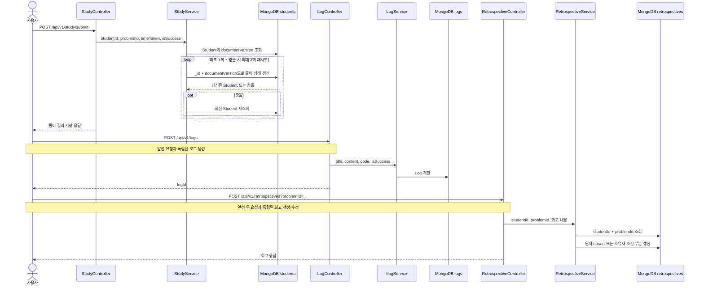

# 학습 결과, 코드 로그, 회고 저장

## 목적

풀이 결과, 작성 코드, 회고를 각각의 용도에 맞는 문서에 저장한다.

세 기록은 하나의 요청이 아니다. 클라이언트가 `study`, `logs`, `retrospectives` API를 각각 호출하며 공통 트랜잭션도 없다. 서버는 제출 코드를 BOJ에 전송하거나 채점하지 않고, 사용자가 보낸 `isSuccess`와 `resultType`을 기록한다.

## 실제 요청과 저장 위치

| 요청 | 저장 내용 | 저장 위치 |
| --- | --- | --- |
| `POST /api/v1/study/submit` | 문제 ID, 풀이 시간, 성공 여부, 풀이 시각 | MongoDB `students.solutions` 내장 배열 |
| `POST /api/v1/logs` | 제목, 본문, 코드, 학생 ID, 생성 시점 BOJ ID, 성공 여부 | MongoDB `logs` |
| `POST /api/v1/retrospectives?problemId=...` | 회고, 요약, 결과, 풀이 전략, 풀이 시간 | MongoDB `retrospectives` |

세 요청 모두 인증이 필요하고 Controller는 `Authentication.name`을 변경되지 않는
MongoDB 학생 ID로 읽는다. JWT subject의 BOJ ID는 화면 표시와 발급 시점 정보로만
남기며 소유권 키로 사용하지 않는다.

## 요청 흐름

## 코드 경로

### 1. 풀이 결과

1. `StudyController.submitSolution`은 인증 principal 이름을 불변 `studentId`로 사용한다.
2. `StudyService.submitSolution`은 `StudentRepository.findById`와 `ProblemRepository.findById`로 학생과 문제의 존재를 확인한다.
3. `Student.solveProblem`은 요청의 boolean을 `SUCCESS` 또는 `FAIL`로 바꾼다.
4. 같은 문제를 같은 날 다시 제출하면 더 늦은 `solvedAt`의 시간·결과·시각을 유지한다. 다른 날짜의 기록은 보존하고 배열은 풀이 시각순으로 정렬한다.
5. 요청 시각을 한 번 고정하고 연속 풀이 일수와 마지막 풀이 날짜를 계산한다.
6. 학생 ID와 `documentVersion`이 모두 일치할 때 `solutions`, `consecutiveSolveDays`, `lastSolvedAt`만 갱신하고 문서 버전을 증가시킨다.
7. 충돌하면 최신 Student에서 다시 계산해 최대 3회 재시도한다. 모두 실패하면 재시도 가능한 409를 반환한다.
8. 저장 연산이 반환한 Student로 응답을 만들어 Controller의 추가 학생 조회를 하지 않는다.

### 2. 코드 로그

1. `LogController.createLog`가 제목, 내용, 코드, 선택적인 성공 여부와 인증 principal의 `studentId`를 받는다.
2. `LogService.createLog`가 불변 `studentId`를 소유자로, 현재 BOJ ID를 표시용 스냅샷으로 저장한다.
3. 응답은 생성된 `logId`만 반환한다.

### 3. 회고

1. `RetrospectiveController.writeRetrospective`는 인증 principal의 불변 `studentId`를 사용한다.
2. `RetrospectiveService.writeRetrospective`는 학생과 문제의 존재를 확인한다.
3. Problem의 카테고리를 `mainCategory`에 함께 저장한다.
4. `(studentId, problemId)` 회고가 있으면 `_id + studentId` 조건으로 본문과 풀이 정보만 갱신하고, 없으면 원자 upsert로 새 문서를 만든다.
5. 신규 upsert의 유일 인덱스 충돌은 한 번 재시도하고, 반복 충돌은 재시도 가능한 409로 반환한다. 애플리케이션 시작 시 `(studentId, problemId)` 유일 인덱스를 확인하고 없으면 생성한다.
6. 북마크는 MongoDB의 현재 값을 `$not`으로 반전해 동시에 요청한 토글을 모두 반영한다.
7. 사용자 회고 삭제 API는 Student에서 같은 문제의 풀이를 모두 제거하고 남은 풀이로 마지막 풀이일·연속 풀이 일수를 다시 계산한다. 학생 문서 버전 CAS가 충돌하면 최신 Student에서 최대 3회 재계산한 뒤 소유자 조건으로 회고를 삭제한다.

주요 구현 파일:

- `ui/controller/StudyController.kt`
- `application/study/StudyService.kt`
- `domain/Student.kt`
- `ui/controller/LogController.kt`
- `application/log/LogService.kt`
- `ui/controller/RetrospectiveController.kt`
- `application/retrospective/RetrospectiveService.kt`
- `domain/Retrospective.kt`

## 데모 fixture 경계

학습 결과·로그·회고 서비스 자체에는 별도 fixture 구현이 없다. `portfolio-fixture`는 앞 단계의 BOJ 인증 코드·프로필, solved.ac 사용자·문제 메타데이터, BOJ 상세 크롤링만 고정 응답으로 대체한다.

따라서 데모에서도 다음은 실제 경로다.

- 인증 principal에서 불변 `studentId` 추출
- MongoDB 학생의 풀이 배열 갱신
- `logs`, `retrospectives` 문서 생성
- 같은 학생·문제 회고의 원자 upsert와 부분 갱신

## 알려진 제약

- 세 요청 사이에 공통 트랜잭션이나 보상 처리가 없다. 중간 요청이 실패하면 앞서 저장된 기록은 남는다.
- 서버 채점기가 없다. `isSuccess`, 회고의 `resultType`, 풀이 시간은 사용자 입력을 신뢰한다.
- 회고 작성은 먼저 `/study/submit`을 호출했는지 확인하지 않으며, 학생의 Solution과 결과·시간을 대조하지 않는다.
- `Log`에는 `problemId`, `solutionId`, `retrospectiveId`가 없어 세 문서를 영속적으로 연결할 수 없다.
- 기존 데이터에 같은 `(studentId, problemId)` 회고가 여러 건 있으면 초기화기는 문서를 정리하지 않고 시작을 중단한다.
- 풀이 제출은 충돌 시 최대 3회 재시도한다. 같은 학생 문서에 변경이 계속 집중되면
  재시도 가능한 409가 발생할 수 있다.
- 풀이 상태만 부분 갱신하지만 `solutions` 내장 배열 자체는 전체를 다시 쓴다.
- 사용자 회고 삭제 API는 해당 문제의 학생 풀이 기록을 모두 제거하지만 연결 정보가 없는 로그는 삭제하지 않는다. 보관 기간 정리 작업은 회고 문서만 일괄 삭제한다.

풀이 저장 CAS 조건과 실제 MongoDB 동시성 결과는
[풀이 결과 부분 갱신과 충돌 재시도](../refactoring/be-refactor/PHASE_3A_STUDY_SOLUTION_CAS.md)에
정리했다.

회고 부분 갱신, 북마크 토글과 풀이 기록 삭제의 경합 검증은
[회고 원자 갱신과 풀이 기록 삭제 정합성](../refactoring/be-refactor/PHASE_3B_RETROSPECTIVE_ATOMIC_UPDATES.md)에
정리했다.
