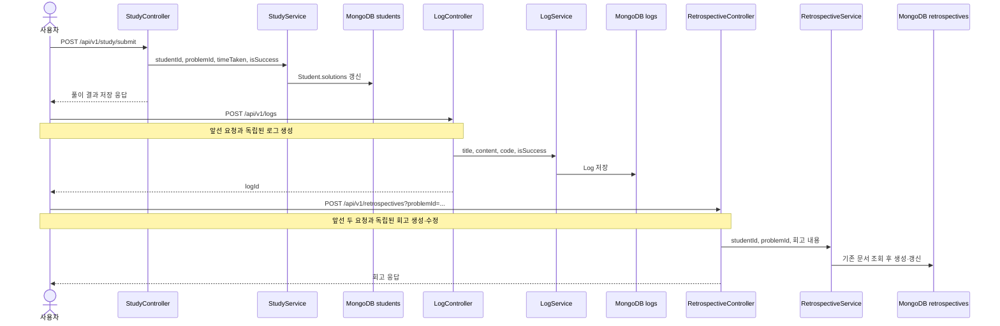

# 학습 결과, 코드 로그, 회고 저장

## 목적

풀이 결과, 작성 코드, 회고를 각각의 용도에 맞는 문서에 저장한다.

세 기록은 하나의 요청이 아니다. 클라이언트가 `study`, `logs`, `retrospectives` API를 각각 호출하며 공통 트랜잭션도 없다. 서버는 제출 코드를 BOJ에 전송하거나 채점하지 않고, 사용자가 보낸 `isSuccess`와 `resultType`을 기록한다.

## 실제 요청과 저장 위치

| 요청 | 저장 내용 | 저장 위치 |
| --- | --- | --- |
| `POST /api/v1/study/submit` | 문제 ID, 풀이 시간, 성공 여부, 풀이 시각 | MongoDB `students.solutions` 내장 배열 |
| `POST /api/v1/logs` | 제목, 본문, 코드, 학생 ID, 생성 시점 BOJ ID, 성공 여부 | MongoDB `logs` |
| `POST /api/v1/retrospectives?problemId=...` | 회고, 요약, 결과, 풀이 전략, 풀이 시간 | MongoDB `retrospectives` |

세 요청 모두 인증이 필요하고 Controller는 `Authentication.name`을 변경되지 않는
MongoDB 학생 ID로 읽는다. JWT subject의 BOJ ID는 화면 표시와 발급 시점 정보로만
남기며 소유권 키로 사용하지 않는다.

## 요청 흐름

## 코드 경로

### 1. 풀이 결과

1. `StudyController.submitSolution`은 인증 principal 이름을 불변 `studentId`로 사용한다.
2. `StudyService.submitSolution`은 `StudentRepository.findById`와 `ProblemRepository.findById`로 학생과 문제의 존재를 확인한다.
3. `Student.solveProblem`은 요청의 boolean을 `SUCCESS` 또는 `FAIL`로 바꾼다.
4. 같은 문제를 같은 날 다시 제출하면 기존 당일 기록을 새 시간·결과·시각으로 교체한다. 다른 날짜의 기록은 유지한다.
5. 연속 풀이 일수와 마지막 풀이 날짜를 함께 갱신한 `Student` 전체를 저장한다.

### 2. 코드 로그

1. `LogController.createLog`가 제목, 내용, 코드, 선택적인 성공 여부와 인증 principal의 `studentId`를 받는다.
2. `LogService.createLog`가 불변 `studentId`를 소유자로, 현재 BOJ ID를 표시용 스냅샷으로 저장한다.
3. 응답은 생성된 `logId`만 반환한다.

### 3. 회고

1. `RetrospectiveController.writeRetrospective`는 인증 principal의 불변 `studentId`를 사용한다.
2. `RetrospectiveService.writeRetrospective`는 학생과 문제의 존재를 확인한다.
3. `(studentId, problemId)` 회고가 있으면 본문과 풀이 정보를 갱신하고, 없으면 새 문서를 만든다.
4. 저장 중 `DuplicateKeyException`이 발생하면 기존 문서를 다시 읽어 갱신을 시도한다. 애플리케이션 시작 시 `(studentId, problemId)` 유니크 인덱스를 확인하고 없으면 생성한다.

주요 구현 파일:

- `ui/controller/StudyController.kt`
- `application/study/StudyService.kt`
- `domain/Student.kt`
- `ui/controller/LogController.kt`
- `application/log/LogService.kt`
- `ui/controller/RetrospectiveController.kt`
- `application/retrospective/RetrospectiveService.kt`
- `domain/Retrospective.kt`

## 데모 fixture 경계

학습 결과·로그·회고 서비스 자체에는 별도 fixture 구현이 없다. `portfolio-fixture`는 앞 단계의 BOJ 인증 코드·프로필, solved.ac 사용자·문제 메타데이터, BOJ 상세 크롤링만 고정 응답으로 대체한다.

따라서 데모에서도 다음은 실제 경로다.

- 인증 principal에서 불변 `studentId` 추출
- MongoDB 학생의 풀이 배열 갱신
- `logs`, `retrospectives` 문서 생성
- 같은 학생·문제의 기존 회고 조회 후 갱신

## 알려진 제약

- 세 요청 사이에 공통 트랜잭션이나 보상 처리가 없다. 중간 요청이 실패하면 앞서 저장된 기록은 남는다.
- 서버 채점기가 없다. `isSuccess`, 회고의 `resultType`, 풀이 시간은 사용자 입력을 신뢰한다.
- 회고 작성은 먼저 `/study/submit`을 호출했는지 확인하지 않으며, 학생의 Solution과 결과·시간을 대조하지 않는다.
- `Log`에는 `problemId`, `solutionId`, `retrospectiveId`가 없어 세 문서를 영속적으로 연결할 수 없다.
- 회고 작성 경로는 `mainCategory`를 설정하지 않아 기본값 `null`로 남는다.
- 기존 데이터에 같은 `(studentId, problemId)` 회고가 여러 건 있으면 초기화기는 문서를 정리하지 않고 시작을 중단한다.
- 학생 문서 전체 저장에는 낙관적 잠금이 적용되어 동시 변경을 덮어쓰지는 않지만,
  같은 학생의 동시 제출 중 한 요청은 충돌 응답을 받을 수 있다.
- 회고 삭제는 해당 문제의 학생 풀이 기록을 모두 제거하지만 연결 정보가 없는 로그는 삭제하지 않는다.
