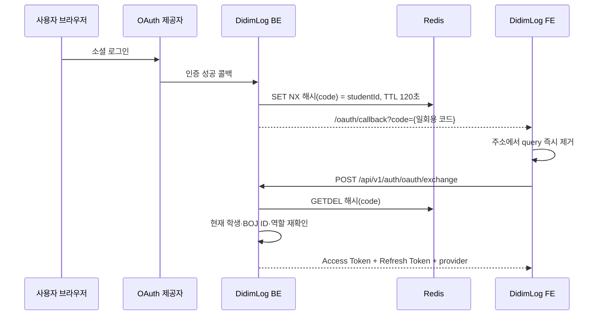

# Phase 2C-4 — OAuth 일회용 코드 교환

## 문제

기존 OAuth 성공 처리는 Access Token을 프론트엔드 콜백 URL에 넣었다. Refresh Token은
전달하지 않았지만 프론트엔드는 두 토큰을 모두 요구해, 연결된 계정도 로그인을 끝낼 수
없었다.

```text
BE: /oauth/callback?token={accessToken}
FE: accessToken + refreshToken이 모두 있어야 로그인 완료
```

URL의 토큰은 브라우저 방문 기록, 리퍼러, 프록시 접근 로그에 남을 수 있다. 신규
사용자 분기에는 이메일과 providerId도 포함됐다. 그러나 신규 OAuth 가입 마무리 API는
이미 `410 Gone`이므로 이 정보는 노출할 이유가 없었다.

## 변경

OAuth 인증 성공 직후에는 토큰 대신 256비트 난수 코드를 발급한다. Redis에는 원문
코드가 아닌 SHA-256 해시 키와 내부 학생 ID만 120초 동안 저장한다.



교환 API는 코드를 먼저 소비한 뒤 학생을 다시 조회한다. 학생이 삭제됐거나 BOJ ID가
없거나 역할이 `GUEST`이면 토큰을 만들지 않는다. 정상적인 `USER`와 `ADMIN`만 현재
역할로 Access Token을 만들고, Refresh Token은 기존 저장 절차로 발급한다.

| 경계 | 처리 |
| --- | --- |
| 코드 저장 | `SET NX`, TTL 120초 |
| Redis 키 | 원문 코드의 SHA-256 해시 |
| Redis 값 | 내부 `studentId` |
| 코드 소비 | `GETDEL` 한 번 |
| 만료·오류·재사용 | 모두 `400 OAUTH_EXCHANGE_CODE_INVALID` |
| 성공 응답 | `Cache-Control: no-store`, `Pragma: no-cache` |
| 신규·BOJ 미연동 계정 | 개인정보 없이 `oauth_signup_not_supported` |
| 리다이렉트 응답 | `no-store`, `no-cache`, `Referrer-Policy: no-referrer` |

교환 응답에는 실제 학생의 provider를 포함한다. 프론트엔드는 임의 기본값을 사용하지
않고 이 값을 저장하므로 GitHub와 Naver 계정이 Google 계정으로 표시되지 않는다.

일회용 코드도 120초 동안은 로그인 권한을 바꿀 수 있는 값이다. 프론트엔드는 첫
비동기 요청 전에 주소에서 query를 지우고 `no-referrer` 정책으로 하위 요청의 Referer
전달을 막는다. 다만 최초 프론트엔드 문서 요청의 URL은 호스팅 접근 로그에 남을 수
있다. 이번 변경은 장기 토큰과 개인정보가 URL에 남는 문제를 줄인 것이며, 최초
구간에서 코드를 탈취하는 상황까지 막는 PKCE 구현은 아니다.

## 검증

다음 항목을 단위 테스트와 실제 Redis 통합 테스트로 확인한다.

- 리다이렉트 URL에 Access Token, Refresh Token, 이메일, providerId가 없음
- 발급된 코드는 URL-safe 256비트 값이며 설정 TTL은 60~120초만 허용
- 같은 코드를 동시에 소비해도 한 요청만 학생 ID를 얻음
- 만료·없는 코드와 재사용한 코드가 같은 오류를 반환
- 삭제된 학생, BOJ 미연동 학생, `GUEST`는 토큰을 발급하지 않음
- 성공 응답에 두 토큰, 현재 프로필 수치, provider와 캐시 금지 헤더가 포함됨
- 프론트엔드가 교환 요청 전에 주소의 query를 지우고 StrictMode에서도 한 번만 요청함

```bash
./gradlew clean check \
  jacocoMergedReport \
  jacocoFullMergedReport \
  jacocoCoreCoverageVerification \
  jacocoFullCoverageVerification \
  --no-daemon
```

| 항목 | 결과 |
| --- | --- |
| OAuth 교환 관련 단위 테스트 | 17개 통과 |
| 실제 Redis 동시 소비 테스트 | 20개 동시 요청 중 학생 ID 반환 1건 |
| 전체 단위 테스트 | 545개 통과 |
| 전체 통합 테스트 | 91개 중 84개 통과, 조건부 테스트 7개 제외 |
| JaCoCo gate | core-v1, full-v1 모두 통과 |

이 단계는 보안 경계와 FE·BE 계약을 바로잡은 작업이다. 처리량이나 응답 시간의
유의미한 전후 차이를 측정한 작업이 아니므로 성능 향상률은 기록하지 않는다.

## 남은 범위

- 신규 OAuth 가입을 다시 제공할 경우 provider 정보를 서버에 묶은 별도 가입 코드 설계
- 브라우저 저장소의 Refresh Token을 HttpOnly 쿠키로 옮길지 검토
- 일회용 코드를 브라우저 요청과 묶는 PKCE 또는 nonce 적용 검토
- 여러 BE 인스턴스를 순차 배포할 때 교환 엔드포인트와 리다이렉트 전환 시점 분리
