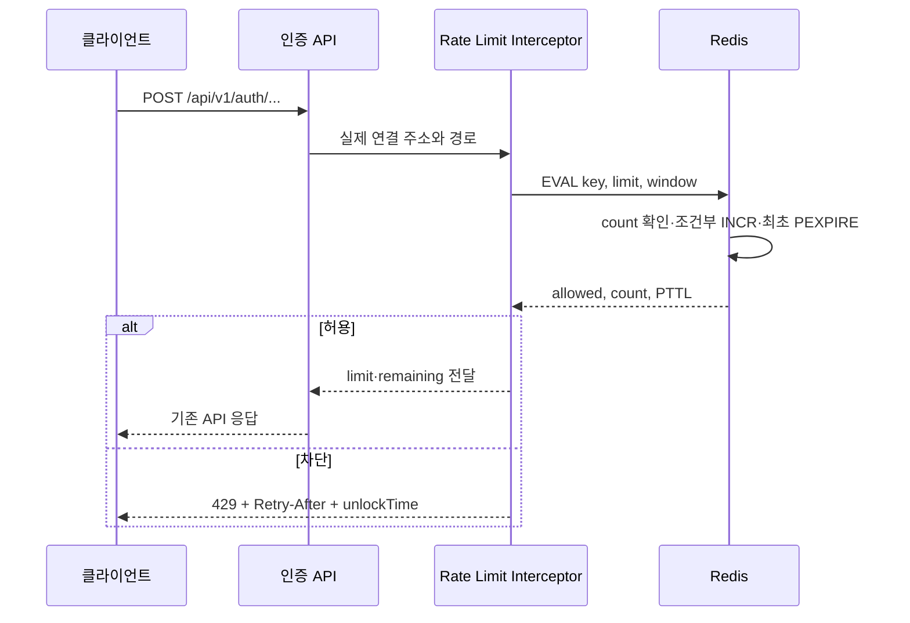

# Phase 2D — 인증 요청 제한 원자화

## 문제

기존 요청 제한은 Redis 값을 읽은 뒤 증가시키고 만료 시간을 설정했다.

```text
GET → 한도 비교 → INCR → EXPIRE
```

이 연산들은 서로 분리돼 있어 같은 키로 요청이 동시에 들어오면 여러 요청이 같은
카운터를 읽고 모두 통과할 수 있었다. `INCR` 뒤 `EXPIRE`가 실패하면 만료되지 않는
키가 남고, 허용 요청마다 만료 시간이 다시 1시간으로 늘어나 문서에 적힌 고정 구간과
실제 동작도 달랐다.

요청 주소를 구할 때 `X-Forwarded-For`와 `X-Real-IP`를 바로 신뢰한 점도 문제였다.
신뢰할 프록시 경계가 정해지지 않은 상태에서는 호출자가 헤더 값만 바꿔 제한 키를
계속 새로 만들 수 있다. 정상 계정으로 로그인하면 로그인 카운터를 지우던 동작도 같은
IP의 무차별 대입 예산을 되돌릴 수 있었다.

## 변경

카운터 확인, 증가, 최초 만료 설정을 Lua 한 번으로 처리한다. 첫 요청이 만든 만료
시간은 후속 허용·차단 요청이 연장하지 않는다. 예전 코드가 남긴 TTL 없는 키는 같은
스크립트에서 한 번 복구한다.



`/boj/code`는 인터셉터가 아니라 `BojOwnershipVerificationService`가 같은
`RateLimitService`를 호출한다. 발급 횟수를 먼저 원자적으로 기록한 뒤 코드를 만들고
저장하므로, 이후 저장이 실패해도 해당 시도의 제한 횟수는 복구하지 않는다. 나머지
표의 경로는 인터셉터에서 요청 본문을 읽기 전에 제한한다.

Spring Boot는 `forward-headers-strategy=native`로 Tomcat `RemoteIpValve`를
사용한다. Docker 네트워크에서 Nginx를 `172.28.0.10`으로 고정하고 이 주소만 내부
프록시로 신뢰한다. 저장소의 Nginx 설정은 클라이언트가 보낸 전달 헤더를 이어 붙이지
않고 실제 연결 주소로 덮어쓴다. 애플리케이션은 서버가 정규화한 `remoteAddr`만
읽는다. BE의 8080 포트도 `127.0.0.1`에만 열어 외부 요청이 Nginx를 건너뛰는 경로를
막았다.

정책 선택에는 원본 URI 문자열이 아니라 Spring MVC가 매칭한 경로 패턴을 사용한다.
따라서 `/log%69n`처럼 같은 컨트롤러로 해석되는 인코딩 경로도 `/login` 정책을
우회하지 못한다.

로그인 성공 시 카운터를 지우지 않는다. 인터셉터가 만든 `RateLimitDecision`을 요청
속성으로 넘겨 로그인 실패 응답이 같은 시점의 남은 횟수를 사용하도록 했다. 따라서
컨트롤러가 Redis를 다시 조회하지 않는다.

## 적용 정책

모든 정책은 `POST` 요청에만 적용한다. 관리자로 인증됐더라도 공개 인증 API의 제한을
우회하지 않는다.

| 키 | 경로 | 제한 |
| --- | --- | ---: |
| `signup:{연결 주소}` | `/signup`, `/super-admin` | 합계 5건/60분 |
| `login:{연결 주소}` | `/login` | 10건/60분 |
| `password_reset:{연결 주소}` | `/find-account`, `/find-id`, `/find-password`, `/reset-password` | 합계 3건/60분 |
| `boj_code:{연결 주소}` | `/boj/code` | 5건/1분 |
| `boj_verify:{연결 주소}` | `/boj/verify` | 10건/1분 |

OAuth 교환 코드는 256비트 일회용 값이고 Refresh 요청은 유효한 토큰을 검사하므로 이
IP 정책에서는 제외했다. 더 이상 제공하지 않는 `/signup/finalize`도 제외했다.

허용·차단 응답에는 `X-Rate-Limit-Limit`과 `X-Rate-Limit-Remaining`을 넣는다.
차단 응답에는 `Retry-After`, `RATE_LIMIT_EXCEEDED`, `remainingAttempts=0`,
한국 시간 기준 `unlockTime`을 함께 반환한다.

## Redis 왕복 수

아래 값은 응답 시간 측정치가 아니라 변경 전후 코드 경로의 Redis 왕복 수다.

| 경로 | 변경 전 | 변경 후 |
| --- | ---: | ---: |
| 허용 요청 | `GET + INCR + EXPIRE` 3회 | `EVAL` 1회 |
| 차단 요청 | `GET + TTL` 2회 | `EVAL` 1회 |
| 로그인 실패 | 인터셉터 3회 + 컨트롤러 `GET` 1회 | 인터셉터 `EVAL` 1회 |

지연 시간이나 처리량 개선율은 별도 반복 측정을 하지 않았으므로 기록하지 않는다.

## 검증

실제 Redis 통합 테스트에서 다음 조건을 확인했다.

- 제한 1건인 같은 키에 20개 요청을 동시에 보내 허용 1건, 차단 19건
- 최종 Redis 카운터 `1`
- 한도에 도달한 뒤 차단 요청이 카운터를 늘리지 않음
- 후속 허용·차단 요청이 첫 만료 시간을 연장하지 않음
- TTL 없는 기존 키의 만료 시간 복구
- 이미 한도에 도달한 TTL 없는 키의 차단 상태와 만료 시간 복구
- 값이 0인 기존 키의 남은 만료 시간 미연장
- 고정 구간 만료 뒤 다음 요청 허용

실제 Spring Boot 서버에는 공식 Grafana k6 `v2.0.0`으로 24개 요청을 보냈다.
각 VU는 요청 한 건만 담당하고 공통 시작 시각에 맞춰 요청을 시작한다. 시작 지연
500ms 미만 threshold와 정책별 응답 수를 함께 검사한다. 이 HTTP 검사는 경계 응답과
헤더 계약을 확인하며, 같은 순간의 원자성은 앞의 CountDownLatch Redis 통합 테스트가
검증한다.

실행 ID는 `phase2d-auth-rate-limit-584dbea`, 대상·하네스 SHA는
`584dbea9840a2409e763e14181782a719305ddac`이며 두 작업 트리는 모두 깨끗한
상태였다. 측정 규약은 `be-refactor-phase2d-v1`을 사용했다.

| 정책 | 요청 묶음 | 허용 | 429 | 요청 시작 지연 최댓값 |
| --- | ---: | ---: | ---: | ---: |
| 회원가입 | 7 | 5 | 2 | 1ms |
| 로그인 | 12 | 10 | 2 | 1ms |
| 계정 복구 | 5 | 3 | 2 | 1ms |

검사 성공률은 100%, 예상 밖 상태는 0건, 실패한 threshold는 0건이었다. 이 실행은
정확한 경계 동작을 확인한 것이며 운영 처리량을 뜻하지 않는다.

전체 검증은 단위 테스트 577개, 통합 테스트 99개 중 92개 통과·조건부 테스트 7개
제외로 끝났다. Phase 2C-4 결과와 비교하면 요청 제한 분기 테스트가 추가되면서 full-v1
Line과 Branch가 각각 1%p 이상 올랐다.

| 범위 | Phase 2C-4 | Phase 2D | 변화 |
| --- | --- | --- | --- |
| core-v1 | Line 81.69%, Branch 60.07%, Class 91.46% | Line 82.08%, Branch 60.37%, Class 91.96% | `+0.39%p`, `+0.30%p`, `+0.50%p` |
| full-v1 | Line 65.54%, Branch 46.71%, Class 76.33% | Line 66.68%, Branch 48.23%, Class 76.91% | `+1.14%p`, `+1.52%p`, `+0.58%p` |

두 JaCoCo gate는 모두 통과했다. 재측정한 정수 하한에 맞춰 core-v1 Line 82%·Branch
60%, full-v1 Line 66%·Branch 48%·Class 76%로 gate를 올렸다. 이 수치는 테스트 범위
변화이며 성능 향상률로 해석하지 않는다.

Redis 연결 실패와 timeout은 요청을 통과시키지 않는다. `503
RATE_LIMIT_SERVICE_UNAVAILABLE`과 `retryable=true`를 반환하고 서버 로그에 원인을
남긴다. Redis 연결과 명령 대기 시간은 각각 2초로 제한하며, 배포 환경에서는
`SPRING_DATA_REDIS_CONNECT_TIMEOUT`과 `SPRING_DATA_REDIS_TIMEOUT`으로 바꿀 수 있다.

성능 실행 도구도 함께 확인했다. 고정한 공식 k6 버전 검사나 실행 환경 manifest
생성이 실패했는데도 셸의 `set -e` 예외 때문에 테스트가 이어질 수 있던 경로를 명시적
반환으로 막았다. 로컬 주소 기본값과 Redis DB 번호도 실행·정리 단계에서 같게 맞췄다.

```bash
./gradlew test \
  --tests 'com.didimlog.global.ratelimit.*' \
  --tests 'com.didimlog.global.config.WebInterceptorConfigTest'

./gradlew integrationTest \
  --tests 'com.didimlog.global.ratelimit.RateLimitServiceIntegrationTest'

performance/k6/run-local.sh rate-limit
```

## 남은 범위

- TLS용 Nginx 서버 블록을 별도로 둘 때도 같은 전달 헤더 덮어쓰기 규칙 유지
- Docker 네트워크 대역을 바꾸면 Nginx 고정 주소와 `TRUSTED_PROXY_IP_PATTERN`을 함께 변경
- 여러 서버가 같은 Redis를 사용할 때 운영 키 분포와 차단 비율 관측
- IP 공유 환경에서 계정 단위 보조 제한이 필요한지 운영 자료로 판단
