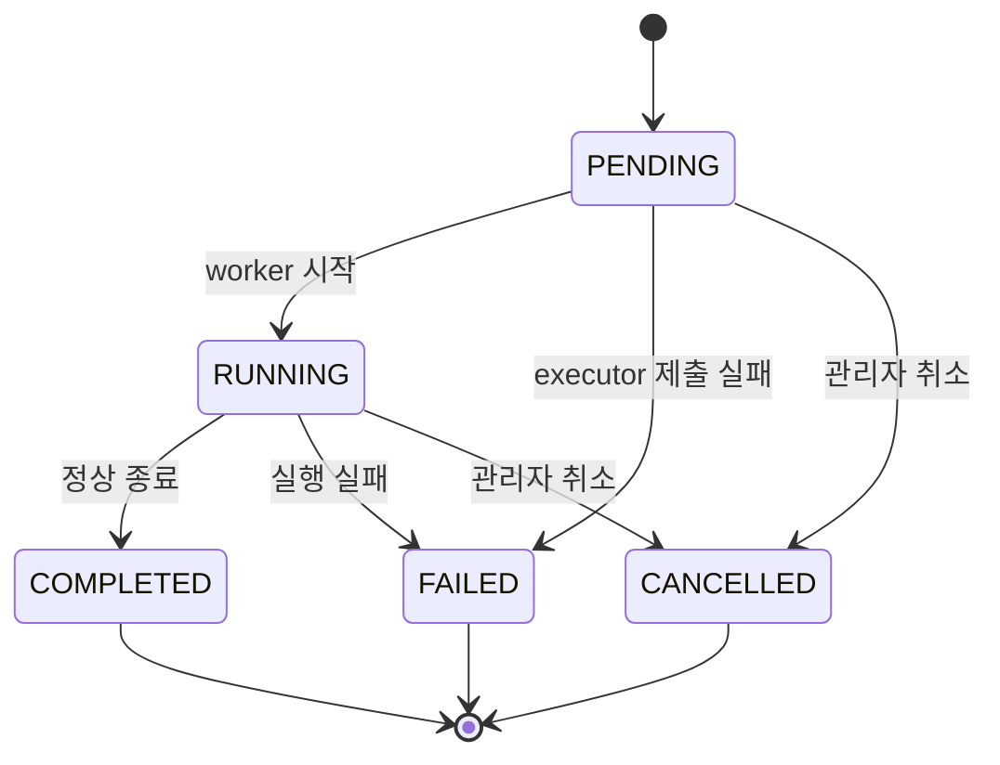

# Phase 6E — 문제 수집 작업 상태 원자 전이

## 문제

문제 수집 작업 상태는 Redis에 저장했지만 갱신 경계는 JVM 내부
`synchronized`에만 의존했다.

```text
GET 작업 상태
→ 애플리케이션에서 다음 상태 계산
→ SETEX 작업 상태
→ ZADD 작업 index
```

한 인스턴스 안에서는 순서가 정리되지만 여러 인스턴스가 같은 Redis를 사용하면
서로 같은 상태를 읽을 수 있다. 한 인스턴스가 작업을 취소한 뒤 다른 인스턴스의
오래된 진행률 저장이 도착하면 `CANCELLED`가 다시 `RUNNING` 또는 `COMPLETED`로
바뀔 수 있었다.

`markRunning`은 `PENDING`이 아닌 기존 작업도 성공으로 처리했다. 따라서 executor에
전달한 같은 `Runnable`이 다시 실행되면 이미 끝난 작업의 외부 호출과 MongoDB
저장이 반복됐다. 상태를 갱신할 때마다 변하지 않는 작업 index도 다시 `ZADD`했다.

## 기준선

- Before SHA: `273dc8688aec84b9aec60184b83438fb7c912d42`
- Redis: `7.2.5`
- Redis DB: `13`
- 두 `ProblemCollectorService` 인스턴스가 같은 Redis를 공유
- 실제 구현에 먼저 회귀 테스트를 적용한 뒤 같은 테스트를 변경 후 다시 실행

| 확인 항목 | Before |
| --- | ---: |
| 같은 `Runnable`을 두 번 실행했을 때 solved.ac 호출 | 2건 |
| 같은 `RUNNING` 원문을 읽은 두 취소 요청의 성공 | 2건 |
| 취소 뒤 늦은 진행률 저장이 끝난 작업의 최종 상태 | `COMPLETED` |
| 문제 6건 작업의 index `ZADD` | 9회 |

앞의 세 항목은 응답 시간이나 처리량이 아니라 작업 상태의 동시성 계약을 확인한
정확성 기준선이다.

## 변경

### 작업 생성

새 작업은 Lua 한 번으로 상태 키와 sorted index를 함께 만든다.

```text
상태 키가 없는지 확인
→ PENDING JSON을 24시간 TTL로 저장
→ 작업 index에 jobId와 queuedAt 기록
```

상태 키가 이미 있으면 기존 값을 바꾸지 않는다. index 키의 자료형도 저장 전에
확인해 상태만 만들어지고 index 기록이 실패하는 경우를 막는다.

### Redis 원문 비교 CAS

공개 응답 DTO에 별도 버전 필드를 추가하지 않았다. Redis에서 읽은 JSON 문자열
자체를 기대값으로 보관하고 Lua가 현재 값과 같은지 비교한다.

```text
GET 현재 JSON
→ expected JSON과 동일한지 비교
→ 같을 때만 다음 JSON을 TTL과 함께 저장
```

기존 JSON을 다시 직렬화해 비교하지 않으므로 속성 순서가 다른 기존 값도 처음 읽은
원문 그대로 갱신할 수 있다. CAS가 실패하면 최신 상태를 다시 읽거나, 진행률처럼
오래된 값은 버린다.



| 동작 | 허용 상태 | 충돌 처리 |
| --- | --- | --- |
| worker 시작 | `PENDING` | CAS 실패 시 해당 실행 종료 |
| 진행률 저장 | `RUNNING` | 오래된 진행률 폐기 |
| 완료 | `RUNNING` | 최신 상태가 계속 `RUNNING`일 때만 재시도 |
| 실행 실패 | `PENDING`, `RUNNING` | 허용 상태일 때만 재시도 |
| 취소 | `PENDING`, `RUNNING` | 최신 상태를 다시 읽고 최대 4회 시도 |

`COMPLETED`, `FAILED`, `CANCELLED`는 이후 진행률·완료·실패 저장으로 바뀌지 않는다.
동시 취소에서 CAS를 잃은 요청은 최신 종료 상태를 읽고 기존
`JOB_ALREADY_TERMINAL` 409를 반환한다. 상태가 계속 바뀌어 재시도를 모두 쓰면
`RESOURCE_STATE_CONFLICT` 409를 반환한다.

### 작업 index 쓰기 범위

`queuedAt`과 index membership은 작업을 만든 뒤 바뀌지 않는다. 따라서 `ZADD`는 생성
스크립트에서 한 번만 실행하고 진행률·완료·실패·취소 갱신에서는 실행하지 않는다.

문제 6건의 같은 fixture를 no-op pacer로 실행했을 때 cold·warm 모두 다음 결과였다.

- 기능 결과 SHA-256은 Phase 4B 측정과 동일
- MongoDB `problems` 명령은 `update=6`으로 동일
- solved.ac 호출은 6건으로 동일
- 작업 index `ZADD`는 `9 → 1`
- 변경 후 Redis commandstats는 `evalsha=9`, `exists=1`, `get=23`, `set=9`,
  `type=1`, `zadd=1`

변경 후 `get=23`에는 Lua 내부의 비교용 `GET` 8회가 포함된다. 스크립트 cache가 비어
있으면 최초 실행에 `EVAL`이 최대 2회 추가될 수 있다. 이 값으로 전체 Redis 명령이나
응답 시간의 개선율을 계산하지 않는다.

## 검증

대상 단위·통합 테스트:

```bash
TEST_REDIS_PORT=6398 \
SPRING_DATA_REDIS_HOST=127.0.0.1 \
SPRING_DATA_REDIS_PORT=6398 \
./gradlew test \
  --tests 'com.didimlog.application.problem.collector.ProblemCollectorServiceTest' \
  integrationTest \
  --tests 'com.didimlog.application.problem.collector.ProblemCollectorJobStateIntegrationTest' \
  --rerun-tasks
```

실제 Redis 경합 통합 테스트는 같은 조건으로 5회 연속 통과했다. 수집 기준선도 실제
MongoDB 7.0.16과 Redis 7.2.5에서 cold·warm 시나리오를 다시 실행해 기능 hash와 명령
수를 확인했다. 두 worker의 동시 `PENDING` 선점은 한 실행만 성공했고, 공백이 다른
기존 JSON도 읽은 원문을 기대값으로 사용해 별도 변환 없이 취소됐다. 전용
MongoDB·Redis에 연결한 전체 `clean check`도 통과했다.

| 확인 항목 | Before | After |
| --- | ---: | ---: |
| 같은 `Runnable`의 solved.ac 호출 | 2건 | 1건 |
| 같은 원문의 동시 취소 성공 | 2건 | 1건 |
| 취소 뒤 늦은 진행률 저장의 최종 상태 | `COMPLETED` | `CANCELLED` |
| 문제 6건 작업의 index `ZADD` | 9회 | 1회 |

이 단계에서는 동일 작업 실행 수와 terminal 상태 보존을 검증했다. 같은 부하를
반복한 지연 시간·처리량 측정은 하지 않았으므로 성능 향상률은 기록하지 않는다.

## 남은 제한

- 구 버전 worker는 CAS 없이 같은 상태 키를 `SET`한다. 구·신 버전 혼합 실행은
  지원하지 않으며 구 worker를 종료한 뒤 전체 교체해야 한다.
- 작업 생성 Lua는 상태 키와 index 키 두 개를 함께 사용한다. 현재 standalone Redis
  구성을 기준으로 하며 Redis Cluster로 옮길 때는 같은 hash slot을 보장해야 한다.
- 작업 상태 TTL은 24시간이다. 주·월 메트릭을 장기간 보존하는 정책은 별도 단계다.
- 서버 재시작 뒤 `RUNNING` 작업을 이어받는 worker lease와 복구 절차는 없다.
- 작업 목록은 sorted index에서 ID를 읽은 뒤 상태를 하나씩 조회하는 1+N 구조가
  남아 있다.
- 실패한 항목을 별도로 보관하는 ledger가 없고 checkpoint는 마지막 처리 ID만
  기록한다. 실패 항목 재시도와 대상 정렬 정책은 별도 단계다.
- 취소는 항목 사이에서 확인한다. 이미 시작한 외부 HTTP 호출이나 대기 시간을 즉시
  중단하지는 않는다.

> 실패 항목 원장과 숫자 순서 기반 재시도는 후속
> [Phase 6H](./PHASE_6H_CRAWLER_FAILED_ITEM_RETRY.md)에서 반영했다. Phase 6E의
> 기준선과 명령 수는 변경하지 않는다.
