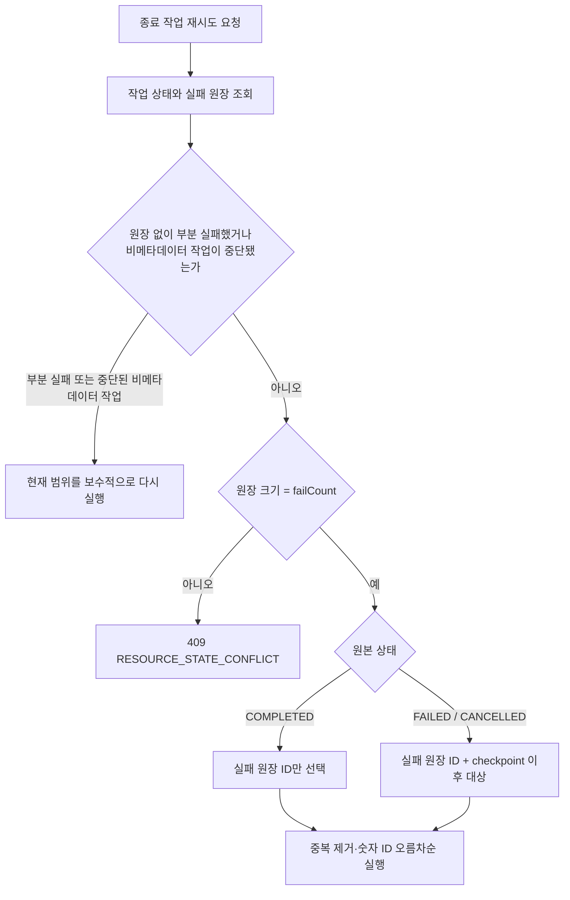

# Phase 6H — 문제 수집 실패 항목 재시도

## 문제

문제 수집 작업은 항목 하나가 실패해도 다음 항목을 계속 처리한다. 이때
`failCount`는 증가하지만 checkpoint도 마지막으로 처리한 문제 ID까지 전진한다.

예를 들어 1~5번 중 문제 ID 2만 실패하면 원본 작업은 다음 상태로 끝날 수 있다.

```text
status=COMPLETED
processedCount=5
successCount=4
failCount=1
lastCheckpointId=5
```

기존 재시도는 checkpoint 다음 범위만 선택했다. 위 작업은 checkpoint가 이미
끝에 있으므로 문제 ID 2를 다시 처리하지 않고 작업 수가 0인 `COMPLETED` 작업을
만들었다.
비메타데이터 작업은 MongoDB 조회 결과를 정렬하지 않아 `[1005, 1001, 1003]`
순서로 처리하다 중단되면 checkpoint보다 작은 미처리 문제가 재시도에서 빠질 수도
있었다.

## 기준선

- Before SHA: `80e7b6c377556f188cccc0ffa7e7b569ee882a7f`
- Redis: `7.2.5`, DB 13
- 고정 범위: 문제 1~5
- 실패 조건: 최초 실행에서 문제 ID 2만 한 번 실패
- 작업 실행은 no-op pacer를 사용해 외부 대기 시간을 제외

| 확인 항목 | Before |
| --- | ---: |
| 최초 작업 종료 상태 | `COMPLETED`, `failCount=1` |
| 재시도에서 실패한 문제 ID 2 호출 | 0건 |
| 재시도 뒤 복구되지 않은 문제 | 1건 |
| 이미 성공한 1·3·4·5번의 재호출 | 0건 |
| 상세 대상 `[1005, 1001, 1003]` 처리 순서 | `1005 → 1001 → 1003` |

이 표는 응답 시간이나 처리량이 아니라 재시도 대상 선택의 정확성을 비교한다.

## 변경

### 실패 항목 원장

작업별 실패 문제 ID를 Redis Set에 보관한다.

```text
problem:job:status:{jobId}    작업 상태 JSON
problem:job:failures:{jobId} 실패 문제 ID Set
problem:job:index             작업 목록 sorted set
```

실패한 항목의 진행 상태를 저장할 때 Lua가 현재 상태 JSON을 기대값과 비교한 뒤
다음 작업을 한 번에 수행한다.

```text
failure key 자료형 확인
→ SADD 실패 문제 ID
→ SET 다음 상태 JSON + 24시간 TTL
→ EXPIRE 실패 원장 24시간
```

Redis Lua는 실행 중 오류가 발생해도 앞서 실행한 명령을 되돌리지 않는다. 따라서
failure key가 Set이 아닌 경우에는 상태를 바꾸기 전에 자료형을 확인하고 실행을
중단한다. 이후 성공 항목이나 종료 상태를 저장할 때도 `failCount > 0`이면 상태와
원장의 TTL을 함께 연장한다.

취소가 진행 상태 CAS보다 먼저 반영되면 오래된 진행 상태와 실패 ID는 모두
저장되지 않는다. 상태 키가 만료돼 작업 index의 오래된 항목을 정리할 때 실패
원장도 함께 삭제한다.

### 재시도 대상 선택



- `COMPLETED`: 실패 원장에 기록된 문제만 다시 처리한다.
- `FAILED`, `CANCELLED`: 실패 문제와 checkpoint 이후 미처리 대상을 합친다.
- 같은 문제는 한 번만 선택하고 숫자 문제 ID 오름차순으로 처리한다.
- Set이 존재하지만 원장 크기와 `failCount`가 다르면 새 작업을 만들지 않고
  `409 RESOURCE_STATE_CONFLICT`를 반환한다.
- 실패 원장 key가 Set이 아닌 자료형이어도 재시도를 시작하지 않고 같은 409를
  반환한다.
- 원장이 도입되기 전에 생성된 24시간 이내 부분 실패 작업은 메타데이터 원본 범위
  또는 현재 조회 가능한 상세·언어 대상을 다시 실행한다. `FAILED`·`CANCELLED`
  비메타데이터 작업은 `failCount=0`이어도 과거의 정렬되지 않은 처리 순서를
  구분할 수 없으므로 같은 fallback을 사용한다. 범위가 있는 상세 새로고침은 원본
  범위 안으로 제한한다.
- 비메타데이터 실패 문제가 그 사이 MongoDB에서 삭제됐다면 더 이상 처리할 대상이
  아니므로 제외하고 남은 문제를 계속 처리한다.

새 작업의 checkpoint는 실제 항목을 처리하기 전까지 `null`이다.

## 결과

| 확인 항목 | Before | After |
| --- | ---: | ---: |
| 재시도에서 실패한 문제 ID 2 호출 | 0건 | 1건 |
| 재시도 뒤 복구되지 않은 문제 | 1건 | 0건 |
| 이미 성공한 1·3·4·5번의 재호출 | 0건 | 0건 |
| 상세 대상의 숫자 순서 위반 | 1건 | 0건 |

정상 성공 작업 6건의 cold·warm 기준선도 다시 실행했다.

- MongoDB 명령: cold·warm 모두 `update=6`
- Redis 명령: `evalsha=9`, `exists=1`, `get=23`, `set=9`, `type=1`,
  `zadd=1`
- solved.ac 호출: 6건
- 기능 결과 SHA-256:
  - cold:
    `bdaca886ba6b22eb0cc5a28a7ab36549cad87fad26c50c22cfc60b78eaf5216e`
  - warm:
    `aba92ba659fe41f5af6b5150341c04b6514c06c7527bb2637af80eb4516054db`

기능 결과·MongoDB 명령·solved.ac 호출은 Phase 4B와 같고, Redis 명령 구성은
Phase 6E와 같다. 이번 단계는 실패 항목 복구 정합성을 다뤘으므로 응답 시간이나
처리량 개선율은 기록하지 않는다.

## 검증

대상 테스트:

```bash
TEST_REDIS_PORT=6398 \
SPRING_DATA_REDIS_HOST=127.0.0.1 \
SPRING_DATA_REDIS_PORT=6398 \
./gradlew test \
  --tests 'com.didimlog.application.problem.collector.ProblemCollectorServiceTest' \
  integrationTest \
  --tests 'com.didimlog.application.problem.collector.ProblemCollectorJobStateIntegrationTest'
```

- 단위 테스트 20건 통과
- 실제 Redis 통합 테스트 9건 통과
- 실패 ID 단독 재시도, 취소 작업의 실패 ID와 tail 합집합, 구버전 fallback,
  원장 불일치 409, 삭제된 실패 대상 제외를 확인
- 잘못된 failure key 자료형에서 실패 진행 상태의 부분 저장 0건과 재시도 409 확인
- 상태와 실패 원장의 TTL이 모두 `1..86400`초이고 차이가 1초 이하인지 확인
- 실제 MongoDB·Redis cold·warm 기준선 2건 통과
- 전용 MongoDB·Redis에 연결한 `clean check` 통과
  - 단위 테스트 736건 통과
  - 통합 테스트 213건 중 204건 통과, 조건부 9건 제외
  - core·full JaCoCo 검증 통과

## 남은 제한

- Phase 6H 시점의 공개 `range`는 선택 대상의 최솟값과 최댓값만 담아 `{2, 5}`
  같은 비연속 자식 작업이 다시 중단되면 중간 ID를 중복 처리할 수 있었다. 후속
  [Phase 6L](./PHASE_6L_CRAWLER_TARGET_MANIFEST.md)에서 실제 대상 ID와 순서를
  별도 manifest로 저장해 이 제한을 해소했다.
- 같은 원본 작업의 재시도 요청을 동시에 보내면 여러 자식 작업이 만들어질 수
  있다. 원본별 retry claim은 별도 단계다.
- 서버 재시작 뒤 `PENDING`·`RUNNING` 작업을 자동으로 이어받는 worker lease는
  없다. 후속 [Phase 6K](./PHASE_6K_CRAWLER_STARTUP_ORPHAN_RECOVERY.md)는 단일
  BE 시작 시 진행 작업을 `FAILED`로 정리한다.
- 취소는 항목 사이에서 확인하므로 이미 시작한 외부 HTTP 호출은 끝날 수 있다.
- 상태와 실패 원장의 TTL은 24시간이다. 주·월 메트릭을 장기간 보존하는 정책은
  별도 단계다.
- 작업 목록은 sorted index에서 ID를 읽은 뒤 상태를 하나씩 조회하는 1+N 구조다.
- 다중 키 Lua는 현재 standalone Redis 구성을 기준으로 한다. Redis Cluster에서는
  같은 hash slot을 보장해야 한다.

> 작업 목록의 1+N 조회는 후속
> [Phase 6J](./PHASE_6J_CRAWLER_JOB_LIST_BATCH_READ.md)에서 일괄 처리했다.
> 정확한 재시도 대상 저장은 후속
> [Phase 6L](./PHASE_6L_CRAWLER_TARGET_MANIFEST.md)에서 처리했다.
> Phase 6H의 실패 항목 재시도 기준선과 결과는 변경하지 않는다.
