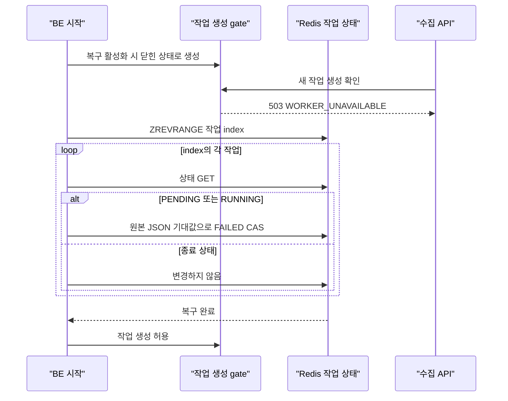

# Phase 6K — 문제 수집 재시작 고아 작업 정리

## 문제

문제 수집 작업 상태는 Redis에 24시간 남지만 실제 실행 코드는 BE 프로세스의
`TaskExecutor`에 등록된 `Runnable`이다. 단일 BE가 작업 중 재시작되면 실행 주체는
사라지고 Redis에는 `PENDING` 또는 `RUNNING` 상태만 남을 수 있었다.

이 상태는 스스로 진행되지 않고 종료 상태도 아니어서 재시도 API도 사용할 수
없었다. 작업 상태가 만료될 때까지 관리자 화면에는 멈춘 작업으로 남는 경로였다.

## 적용 범위

이번 단계는 **단일 BE 인스턴스의 전체 재시작**만 다룬다.

- 애플리케이션 기본값은 복구 비활성화다.
- BE가 하나인 기본 Docker Compose에서만 복구를 명시적으로 활성화한다.
- 시작 시 이전 `PENDING`·`RUNNING` 작업을 이어서 실행하지 않고 `FAILED`로
  종료한다.
- 원본 작업은 다시 `RUNNING`으로 바꾸지 않는다. 관리자가 기존 재시도 API를
  호출하면 별도 작업을 만든다.
- 여러 BE 인스턴스나 순차 교체 배포에서는 설정을 켜지 않는다.

정확한 대상 목록과 worker 소유권을 저장하지 않은 상태에서 자동 재개하면 이미
처리한 문제를 중복 실행하거나 다른 인스턴스의 정상 작업을 실패 처리할 수 있다.
따라서 이 단계에서는 재개보다 안전한 종료를 선택했다.

## 시작 순서



`ApplicationRunner`가 복구를 끝낸 뒤에만 gate를 연다. Redis 연결 오류나 잘못된
자료형처럼 복구 자체를 신뢰할 수 없는 오류가 발생하면 예외를 전파해 애플리케이션
시작을 실패시키고 gate도 닫힌 상태로 둔다.

## 상태 변경

작업 index를 읽은 뒤 각 상태를 기존 Lua CAS로 변경한다.

```text
PENDING ─┐
         ├─> FAILED
RUNNING ─┘    errorCode = WORKER_UNAVAILABLE

COMPLETED / FAILED / CANCELLED -> 변경 없음
```

복구 시 다음 값은 유지한다.

- `totalCount`, `processedCount`, `successCount`, `failCount`
- `range`, `lastCheckpointId`
- 실패 문제 ID 원장
- 작업 index membership

상태를 `FAILED`로 바꾸고 `completedAt`, `lastHeartbeatAt`, `errorCode`,
`errorMessage`를 종료 시점에 맞게 갱신한다. 종료 상태이므로
`estimatedRemainingSeconds`는 `null`이 된다. 상태와 실패 원장의 TTL은 다시
24시간으로 맞춘다. 손상된 JSON은 해당 작업만 건너뛰고 다른 작업을 계속
처리한다.

복구 메서드는 작업 생성 gate가 닫힌 시작 단계에서만 실행할 수 있다. 시작 완료
뒤 다시 호출하면 Redis를 읽기 전에 실패하므로 정상 실행 중인 작업을 일괄 종료할
수 없다.

## 늦은 worker 차단

worker는 각 항목을 시작하기 전과 전체 완료 처리 전에 상태가 정확히 `RUNNING`인지
확인한다. 복구가 작업을 `FAILED`로 바꾸면 다음 항목과 `COMPLETED` 덮어쓰기는
중단된다.

이미 시작한 외부 요청이나 MongoDB 쓰기까지 취소하거나 되돌리지는 않는다. 검증
fixture에서도 첫 번째 외부 호출과 그 결과의 MongoDB 저장 한 건은 끝날 수
있었지만 다음 문제 호출, 진행률 갱신과 완료 상태 덮어쓰기는 발생하지 않았다.
이번 단계는 exactly-once 처리나 side effect fencing을 보장하지 않는다.

감사 로그용 비동기 실행기가 작업 생성 로그 제출을 거절해도 수집 worker 제출은
계속한다. 작업 상태만 `PENDING`으로 만든 뒤 실행이 끊기는 별도 경로를 막기 위한
처리다.

## 설정

| 위치 | 값 | 의미 |
| --- | --- | --- |
| 애플리케이션 기본값 | `false` | 다중 인스턴스 여부를 알 수 없으므로 복구하지 않음 |
| 단일 BE Docker Compose | `true` | 시작 시 이전 진행 작업을 `FAILED` 처리 |
| 다중 BE·순차 교체 배포 | `false` 유지 | lease·fencing 도입 전 다른 인스턴스 작업 보호 |

환경 변수:

```text
PROBLEM_COLLECTOR_FAIL_ORPHANED_JOBS_ON_STARTUP
```

## 실제 Redis 검증

Redis 7.2.5의 별도 DB를 사용해 다음 경계를 확인했다.

| 조건 | 결과 |
| --- | --- |
| `PENDING` 1건·`RUNNING` 1건·종료 상태 3건 | 진행 작업 2건만 `FAILED`, 종료 상태 JSON 3건 원문 유지 |
| 두 서비스·고아 작업 12건 동시 복구 | 첫 상태 읽기를 맞춘 CAS 경합에서 작업별 성공 전이 1회 |
| 상태·실패 원장 TTL 60초 | 복구 뒤 둘 다 86,400초 ±5초 |
| 손상된 상태 JSON 1건·정상 고아 작업 1건 | 손상 작업을 건너뛰고 정상 작업 복구 |
| 상태 key가 Redis List | 시작 실패, 작업 생성 gate 닫힘 유지 |
| 복구 완료 뒤 재실행 | 시작 단계 검사에서 거절, Redis 원문 유지 |
| 첫 문제 처리 중 복구 | 첫 저장은 끝날 수 있으나 두 번째 외부 호출 0건·완료 덮어쓰기 0건 |

## 전체 검증과 커버리지

- Before main SHA: `499b628cb0c08a18337390464bb878ec2fe96346`
- Phase 6K 코드 SHA: `271cb689146d24248670022eb26fa52e0c9acb1b`
- MongoDB: 7.0.16
- Redis: 7.2.5

전용 MongoDB와 Redis에 연결해 `clean check`를 실행했다.

| 범위 | 직전 main | Phase 6K | 변화 |
| --- | ---: | ---: | ---: |
| 단위 테스트 | 738개 통과 | 744개 통과 | 6개 증가 |
| 통합 테스트 | 224개 중 215개 통과, 조건부 9개 제외 | 230개 중 221개 통과, 조건부 9개 제외 | 통과 6개 증가 |
| core-v1 Line / Branch / Method | 88.99% / 66.78% / 87.65% | 88.99% / 66.78% / 87.65% | 변화 없음 |
| full-v1 Line / Branch / Method | 78.71% / 60.60% / 78.63% | 78.84% / 60.88% / 78.72% | +0.13%p / +0.28%p / +0.09%p |

이 표는 복구 경계의 테스트 범위와 전체 회귀 검사 결과다. 시작 시간, 처리량이나
운영 성능 개선율을 뜻하지 않는다.

재현 명령:

```bash
TEST_REDIS_PORT=6398 \
SPRING_DATA_REDIS_HOST=127.0.0.1 \
SPRING_DATA_REDIS_PORT=6398 \
./gradlew integrationTest \
  --tests 'com.didimlog.application.problem.collector.ProblemCollectorOrphanRecoveryIntegrationTest' \
  --tests 'com.didimlog.application.problem.collector.ProblemCollectorJobStateIntegrationTest'
```

## 남은 범위

- 작업을 자동으로 이어서 실행하지 않는다. 원본은 `FAILED`로 남고 재시도는 새
  작업을 만든다.
- Phase 6K 시점에는 비메타데이터 작업과 떨어진 문제 ID 재시도의 정확한 대상
  manifest가 없었다. 후속
  [Phase 6L](./PHASE_6L_CRAWLER_TARGET_MANIFEST.md)에서 대상 ID와 순서를 저장했다.
- 여러 BE에서 사용할 worker owner, lease, heartbeat 기반 인계와 fencing token이
  없다.
- 이미 시작한 외부 호출과 MongoDB 쓰기는 한 건까지 끝날 수 있다.
- 시작 스캔은 index의 모든 ID를 읽고 상태를 확인한다. index가 커질 때의 시작
  시간 최적화와 선제 정리는 별도 단계다.
- 손상된 JSON은 시작 복구에서 삭제하지 않는다. 작업 목록 조회의 stale 정리는
  index membership과 실패 원장을 제거한다. Phase 6L 이후에는 대상 manifest도
  함께 제거하지만 손상된 상태 key는 TTL이 끝날 때까지 남는다.
- 상태와 실패 원장은 24시간 뒤 만료된다. Phase 6L의 대상 manifest도 같은 TTL을
  사용한다. 장기 운영 메트릭 보존 정책은 별도 단계다.
- Docker Compose 전체 환경 해석은 배포용 `.env`가 있는 환경에서 다시 확인해야
  한다. 현재 검증에서는 Compose 구조와 YAML 문법을 확인했다.

> Phase 6L 이후 시작 복구 CAS는 대상 manifest 참조를 보존하고 String manifest의
> TTL도 상태·실패 원장과 함께 갱신한다. Phase 6K의 복구 기준선과 결과는 변경하지
> 않는다.
