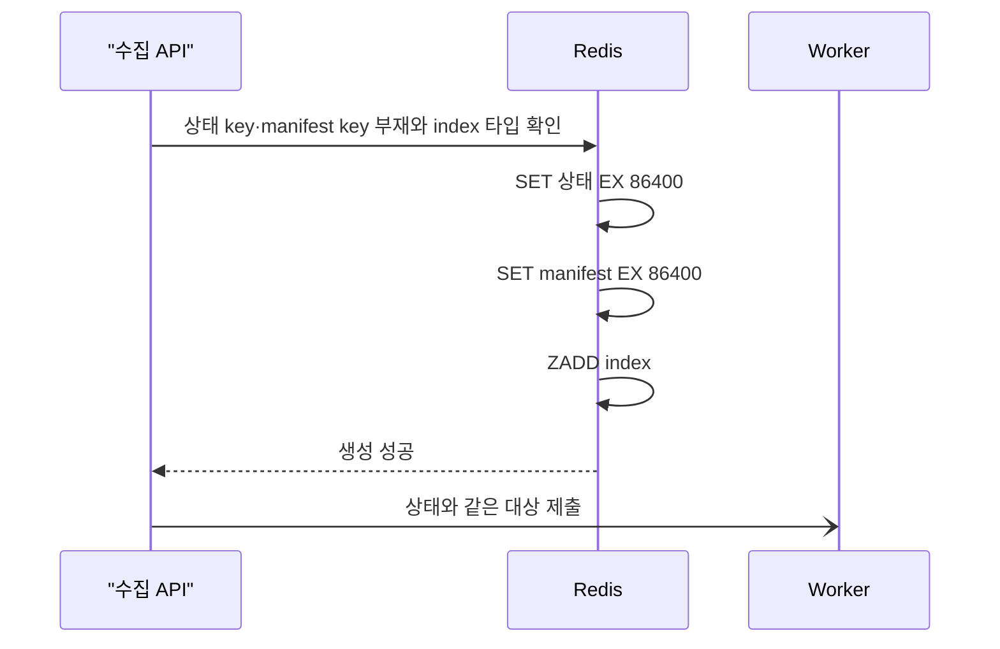

# Phase 6L — 문제 수집 대상 manifest

## 문제

문제 수집 상태에는 공개 범위와 마지막 checkpoint가 있었지만, 실제 worker가
실행한 대상 목록은 남지 않았다.

- `{2, 5}`를 재시도한 자식 작업은 응답에 `range=2..5`만 남아 다시 중단되면
  3번과 4번까지 재시도할 수 있었다.
- 상세 수집·상세 새로고침·언어 갱신은 재시도 시점의 DB를 다시 조회하므로 원본
  작업 뒤 추가된 문제가 섞일 수 있었다.
- 상태가 참조하는 대상 데이터가 사라지거나 손상돼도 이를 구분할 기준이 없었다.

이번 단계는 작업 생성 시점의 **문제 ID와 실행 순서**를 저장하고, 신규 작업의
재시도가 그 대상 안에서만 움직이도록 범위를 고정한다.

## 저장 모델

신규 작업은 상태와 별도의 Redis String에 version 1 manifest를 저장한다.

```text
problem:job:status:{jobId}   작업 상태 JSON
problem:job:targets:{jobId}  대상 manifest JSON
problem:job:failures:{jobId} 실패 문제 ID Set
problem:job:index            queuedAt 기준 sorted set
```

상태의 `targetManifest`에는 schema version과 manifest 원문의 SHA-256만 둔다.
대상 원문을 상태마다 반복 저장하지 않으면서 상태와 대상의 연결을 검증하기 위한
참조다.

```json
{
  "version": 1,
  "jobId": "job-id",
  "jobType": "COLLECT_METADATA",
  "explicitIds": ["2"],
  "range": {
    "start": 4,
    "end": 5
  }
}
```

실행 순서는 `explicitIds` 뒤에 선택적 `range`를 이어 붙인 값이다.

| 작업 | manifest 형태 |
| --- | --- |
| 최초 메타데이터 범위 | 빈 `explicitIds` + 연속 `range` |
| 떨어진 메타데이터 대상 | `explicitIds` |
| 실패 prefix + 미처리 연속 구간 | `explicitIds` + `range` |
| 상세 수집·새로고침·언어 갱신 | 실행 순서의 `explicitIds` |
| 대상이 없는 완료 작업 | 빈 `explicitIds`, `range=null` |

범위가 큰 최초 메타데이터 작업은 ID 전체를 JSON 배열로 펼치지 않는다. 반대로
비연속 대상은 범위로 줄이지 않아 중간 ID가 새 대상이 되는 일을 막는다.

## 원자 생성과 TTL

작업 생성 Lua는 상태, manifest, index를 한 번에 다룬다.



쓰기 전에 상태·manifest key 충돌과 index 자료형을 검사한다. 검사에 실패하면
세 저장 중 어느 것도 실행하지 않는다.

진행률·취소·완료·시작 복구의 상태 CAS가 성공하면 manifest key가 String일 때
TTL도 24시간으로 갱신한다. manifest가 이미 없거나 다른 자료형이어도 실행 중인
worker의 상태 전이는 막지 않는다. 이 경우 엄격한 검증은 manifest를 실제로 읽는
재시도 요청에서 수행한다.

## 재시도 대상 선택

`targetManifest` 참조가 있는 작업은 다음 순서로 검증한다.

1. Redis key가 String인지 확인한다.
2. 원문의 SHA-256이 상태 참조와 같은지 확인한다.
3. version, `jobId`, `jobType`, ID 중복, 범위와 전체 대상 수를 확인한다.
4. `processedCount`가 대상 범위 안에 있는지 확인한다.
5. 마지막 처리 ID가 `lastCheckpointId`와 같은지 확인한다.
6. 실패 원장 ID가 처리 완료 prefix 안에 있는지 확인한다.

검증 뒤 대상은 다음과 같이 고른다.

```text
COMPLETED
  실패한 처리 prefix만
  단, processedCount == totalCount여야 함

FAILED / CANCELLED
  실패한 처리 prefix + manifest의 미처리 suffix
```

비메타데이터 작업은 선택된 ID만 `findAllById`로 조회한 뒤 manifest 순서로
복원한다. 재시도 전에 삭제된 문제는 제외한다. 상세 수집의 미처리 대상은 이미
상세 본문이 채워졌다면 제외하지만, 원장에 기록된 실패 대상은 다시 처리한다.

manifest 참조가 있는데 key가 없거나 자료형·JSON·hash·대상 수·checkpoint가
맞지 않으면 `409 RESOURCE_STATE_CONFLICT`를 반환하고 자식 작업을 만들지 않는다.
참조가 없는 24시간 이내의 기존 작업만 종전 range·현재 DB 조회 경로를 사용한다.

## 검증

Redis 저장·Lua·TTL 경계는 Redis 7.2.5의 별도 DB에서 확인했다. 비메타데이터의
저장소 조회 범위는 MockK 단위 테스트로 호출 인자를 확인했다.

| 조건 | 결과 | 검증 방식 |
| --- | --- | --- |
| 네 작업 유형 생성 | 상태·manifest·index 저장, manifest 순서·대상 수와 executor 제출 4건 일치 | 실제 Redis |
| index가 Redis String | 상태·manifest 부분 생성 0건 | 실제 Redis |
| manifest 없음·잘못된 자료형·손상 JSON·hash 불일치·대상 수 불일치 | 모두 409, 자식 작업 0건 | 실제 Redis |
| `COMPLETED`인데 처리 수가 대상 수보다 작음 | 409, 미처리 suffix 폐기 0건 | 실제 Redis |
| 메타데이터 대상 `[2, 5]`, 2번 처리 뒤 취소 | 재시도는 5번만 호출, 3·4번 호출 0건 | 실제 Redis + MockK 외부 클라이언트 |
| `explicitIds=[2]`, `range=4..5`, 4번까지 처리 | 재시도 manifest는 `explicitIds=[2]`, `range=5..5` | 실제 Redis + MockK 외부 클라이언트 |
| 언어 작업 대상 `[1001, 1003, 1005]`, 첫 항목 뒤 취소 | `findAllById(1003,1005)`만 호출, 현재 DB 전체 조회 0건 | MockK 단위 테스트 |
| 상태·manifest TTL 60초 뒤 취소 | manifest 원문 유지, 두 TTL 모두 86,400초 ±5초 | 실제 Redis |
| 시작 복구로 `RUNNING -> FAILED` | manifest 참조·원문 유지, 상태·실패 원장·manifest TTL 정렬 | 실제 Redis |
| stale 상태 목록 정리 | failure key와 manifest key를 같은 정리 경로에서 삭제 | 실제 Redis |

## 전체 검증

- Before main SHA: `b2166fe4035b8861ae1a94d403614d054def6648`
- Phase 6L 코드 SHA: `700d47600889ae3a69d115bddecd002a8ff7aa9b`
- MongoDB: 7.0.16
- Redis: 7.2.5
- 단위 테스트: 745건 통과
- 통합 테스트: 241건 중 232건 통과, 조건부 9건 제외
- core-v1 Line / Branch / Method: 88.99% / 66.78% / 87.65%
- full-v1 Line / Branch / Method: 78.56% / 60.75% / 78.93%
- `clean check`, core·full JaCoCo 기준 통과
- 독립 코드·테스트 감사에서 잔여 P1·P2 없음

이번 단계는 응답 시간이나 처리량을 줄이는 변경이 아니라 재시도 대상 정합성을
고정하는 변경이다. 별도의 성능 개선율은 기록하지 않는다.

재현 명령:

```bash
SPRING_DATA_MONGODB_URI=mongodb://127.0.0.1:27218/didimlog-test \
TEST_MONGO_PORT=27218 \
TEST_REDIS_PORT=6398 \
SPRING_DATA_REDIS_HOST=127.0.0.1 \
SPRING_DATA_REDIS_PORT=6398 \
./gradlew clean check
```

## 배포와 호환 범위

기존 상태 JSON은 `targetManifest=null`로 읽히므로 별도 일괄 변환은 하지 않는다.
상태 TTL이 24시간이어서 기존 작업은 legacy 경로로 자연스럽게 사라진다.

구버전 서버는 신규 상태를 다시 저장할 때 `targetManifest` 필드를 제거할 수 있다.
따라서 신·구 worker를 섞는 순차 교체는 지원하지 않고 단일 인스턴스 전체 교체를
전제로 한다.

## 남은 범위

- manifest는 문제 ID의 포함 관계와 순서만 고정한다. 당시 제목·본문·언어 등의
  문서 내용 snapshot은 아니다.
- 외부 HTTP 호출과 MongoDB 쓰기의 exactly-once 실행이나 취소 시 rollback을
  보장하지 않는다.
- 재시작 작업 자동 인계, worker owner·lease·heartbeat·fencing token은 없다.
- 같은 원본의 재시도 요청이 동시에 들어오면 여러 자식 작업이 생길 수 있다.
- 상태·실패 원장·manifest는 24시간 뒤 만료되며 index 자체에는 TTL이 없다.
- 여러 key를 다루는 Lua는 standalone Redis 구성을 기준으로 한다. Redis Cluster를
  사용하려면 같은 hash slot 또는 다른 저장 모델이 필요하다.
