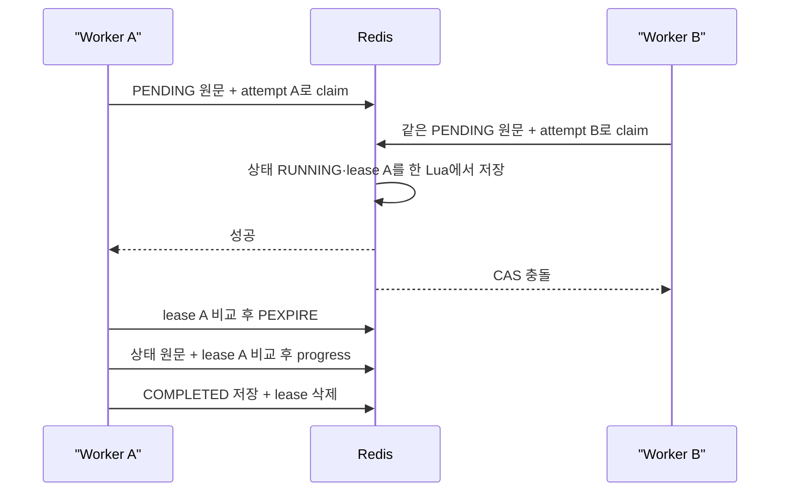

# Phase 6M-A — 문제 수집 worker lease

## 문제

Phase 6E의 상태 CAS는 Redis에 저장된 상태 원문이 같은지만 비교했다. 같은
`PENDING` 작업의 중복 실행은 막았지만, 누가 `RUNNING` 상태를 소유하는지는 남지
않았다.

- 항목 처리가 오래 걸리면 진행률을 저장할 때까지 heartbeat가 갱신되지 않았다.
- 이전 worker와 새 worker를 구분할 값이 없어 만료 뒤 인계 경계를 만들 수 없었다.
- 취소·소유권 변경 뒤 늦게 도착한 진행률과 실패 ID를 현재 worker의 기록과
  구분할 수 없었다.

이번 단계는 Redis 작업 상태의 소유자를 고정한다. 만료 작업을 다른 BE가 자동으로
이어받는 scanner와 MongoDB 쓰기 fencing은 아직 포함하지 않는다.

## 저장 모델

lease 모드의 작업이 `RUNNING`으로 선점되면 상태 응답에 `workerAttempt`가
추가된다.

```json
{
  "schemaVersion": 1,
  "ownerId": "boot-uuid",
  "attemptId": "claim-uuid",
  "attemptNumber": 1
}
```

| 필드 | 의미 |
| --- | --- |
| `ownerId` | BE가 시작될 때 만든 UUID |
| `attemptId` | 작업을 선점할 때마다 만든 UUID |
| `attemptNumber` | 같은 작업 안에서 증가하는 시도 번호 |

`attemptNumber`는 작업 상태의 ABA 구분값이지 MongoDB 쓰기용 전역 fencing
token이 아니다.

같은 JSON을 짧은 TTL의 별도 Redis key에 저장한다.

```text
problem:job:status:{jobId}  작업 상태와 workerAttempt, EX 86400
problem:job:lease:{jobId}   현재 workerAttempt JSON, PX lease duration
```

상태와 lease의 `ownerId`, `attemptId`, `attemptNumber`가 모두 같은 worker만
진행률·실패 원장·heartbeat·완료·실패 상태를 쓸 수 있다.

## 선점과 상태 전이



claim Lua는 쓰기 전에 다음 조건을 확인한다.

1. 상태 원문이 worker가 읽은 `PENDING` 원문과 같다.
2. lease key가 없다.
3. lease TTL이 1ms 이상이다.
4. lease key가 Redis String 이외의 자료형이 아니다.

조건이 맞으면 `RUNNING` 상태와 lease를 같은 Lua에서 저장한다. 두 worker가 같은
원문을 읽어도 하나만 성공한다.

worker 상태 갱신 Lua는 상태 원문과 lease 원문을 모두 비교한다. 실패 문제 ID를
새로 추가할 때는 실패 원장이 Set인지 쓰기 전에 확인하므로 상태만 바뀌는 부분
저장을 만들지 않는다. 대상 manifest는 String일 때만 TTL을 갱신한다. 실행 중
manifest가 사라지거나 자료형이 바뀌어도 현재 상태 전이는 막지 않고, 재시도에서
Phase 6L의 엄격한 manifest 검증을 적용한다.

완료·실패·관리자 취소는 상태 전이와 lease 삭제를 같은 Lua에서 처리한다. 늦은
worker의 `finally` 정리도 자신의 lease 원문이 같을 때만 삭제한다.

## heartbeat와 진행률 경합

heartbeat는 항목 처리와 분리된 전용 scheduler에서 실행한다.

```text
lease 갱신
  현재 lease 원문 비교
  -> 일치하면 PEXPIRE
  -> 불일치하거나 Redis 오류면 현재 프로세스 worker의 소유권 상실 처리

상태 heartbeat 갱신
  현재 상태 원문 + 현재 lease 원문 비교
  -> 진행률 CAS와 충돌하면 다시 읽고 재시도
```

진행률도 CAS 충돌 시 다시 읽고 최대 네 번 시도한다. 저장하지 못하면 다음 항목을
실행하거나 완료 상태를 만들지 않고 소유권을 내려놓는다. 완료 직전에는
`processedCount == totalCount`를 다시 확인한다.

기본값은 lease 90초, heartbeat 20초다. 설정 단계에서 lease가 heartbeat의 세 배
이상이고 두 값이 Redis가 표현할 수 있는 1ms 이상인지 확인한다.

## 시작 복구와 설정

```yaml
app:
  problem-collector:
    worker-lease:
      enabled: false
      lease-duration: 90s
      heartbeat-interval: 20s
```

`PROBLEM_COLLECTOR_WORKER_LEASE_ENABLED`의 기본값은 `false`다.

Phase 6K의 `fail-orphaned-jobs-on-startup`과 worker lease를 함께 켤 수 없다.
다른 BE의 유효한 작업을 시작 인스턴스가 실패 처리할 수 있기 때문이다. Spring
실행기 생성 시점과 서비스의 시작 복구 메서드 양쪽에서 이 조합을 거절한다.

이 단계에는 만료된 `RUNNING` 작업을 찾고 manifest suffix부터 이어받는 scanner가
없다. Redis 오류나 프로세스 중단으로 lease를 잃으면 작업은 `RUNNING`에 남을 수
있으므로 운영 설정은 아직 활성화하지 않는다.

## 검증

Redis 저장·Lua·TTL 경계는 Redis 7.2.5의 별도 DB 10에서 확인했다. 외부
클라이언트와 저장소 호출 횟수, 반복 CAS 충돌은 MockK로 확인했다.

| 조건 | 결과 |
| --- | --- |
| 같은 `PENDING` 원문을 읽은 두 claim | 실제 Redis 성공 1건, MockK 외부 클라이언트·저장소 호출 각 1건 |
| claim 직후 상태와 lease | 같은 `workerAttempt` JSON |
| 처리 시간 2.6초, lease 2초, heartbeat 0.4초 | lease 만료 0건, TTL 재증가 확인 |
| heartbeat와 실패 진행률이 같은 상태 원문으로 경합 | 진행률 재시도 성공, `failCount=1`, 실패 Set ID 1건 |
| lease 값만 새 attempt로 교체 | 이전 worker의 진행률·실패 ID·완료 0건, 새 lease 보존 |
| 이전 heartbeat 실행 완료 뒤 새 lease 확인 | 새 lease 원문·TTL 유지 |
| 실행 중 관리자 취소 | `CANCELLED` 원문 유지, lease 삭제, 늦은 상태·실패 원장 쓰기 0건 |
| 취소 전에 시작한 저장소 upsert 호출 | MockK 호출 1건, Redis `CANCELLED` 원문은 불변 |
| 실행 중 manifest 삭제 | 현재 worker 완료, manifest 재생성 0건 |
| 실패 원장을 잘못된 자료형으로 교체 | 부분 진행률 0건, `FAILED`와 lease 삭제 |
| heartbeat scheduler가 실행을 거부 | 외부 호출 0건, `FAILED`와 lease 삭제 |
| lease key를 Set으로 교체한 뒤 claim | 상태 부분 변경 0건, `PENDING` 유지 |
| MockK 상태 저장에서 진행률 CAS 네 번 충돌 | 다음 항목 호출 0건, 불완전 `COMPLETED` 0건 |
| stale 상태 목록 정리 | failure·manifest·lease key를 같은 정리 경로에서 삭제 |

## 전체 검증

- Before main SHA: `48598f95c62e0cf09d4309eaf4a6984fa26b19d9`
- Phase 6M-A 코드 SHA: `5da9ef9de48aa64eb707f19caf5672ed5dd26a61`
- MongoDB: 7.0.16
- Redis: 7.2.5
- 단위 테스트: 750건 통과
- 통합 테스트: 252건 중 243건 통과, 조건부 9건 제외
- core-v1 Line / Branch / Method: 88.99% / 66.78% / 87.65%
- full-v1 Line / Branch / Method: 78.69% / 61.36% / 79.26%
- `clean check`, core·full JaCoCo 기준 통과
- 독립 코드·테스트 감사에서 잔여 P1·P2 없음

테스트 수는 단위 745건에서 750건, 통합 241건에서 252건으로 늘었다. collector가
core-v1 집계에서 제외되어 core 수치는 같고, full-v1은 Line 78.56% → 78.69%,
Branch 60.75% → 61.36%, Method 78.93% → 79.26%로 바뀌었다.

이번 변경은 응답 시간이나 처리량을 줄이는 최적화가 아니라 worker 상태
정합성을 다루므로 성능 개선율은 기록하지 않는다.

재현 명령:

```bash
SPRING_DATA_MONGODB_URI=mongodb://127.0.0.1:27218/didimlog-test \
TEST_MONGO_PORT=27218 \
TEST_REDIS_PORT=6398 \
SPRING_DATA_REDIS_HOST=127.0.0.1 \
SPRING_DATA_REDIS_PORT=6398 \
./gradlew clean check
```

## 호환 범위와 남은 작업

- 기존 상태 JSON은 `workerAttempt=null`로 읽힌다.
- 구버전 worker는 신규 상태를 다시 저장할 때 `workerAttempt`를 제거할 수 있으므로
  신·구 worker 혼합 실행은 지원하지 않는다.
- 현재 소유권 검증 범위는 Redis 상태·실패 원장·lease다.
- 취소나 lease 교체 전에 시작한 외부 HTTP 호출과 MongoDB 쓰기 한 건은 끝날 수
  있다. exactly-once 실행과 rollback을 보장하지 않는다.
- 만료 작업 자동 인계, manifest suffix 재개, executor 거부 작업 재제출은 후속
  [Phase 6M-B](./PHASE_6M_B_CRAWLER_WORKER_TAKEOVER.md)에 정리했다.
- 메타데이터·상세·언어의 늦은 MongoDB 쓰기 차단과 전역 fencing token은
  Phase 6M-C 범위다.
- heartbeat scheduler는 단일 스레드이며 현재 collector executor의 최대 동시
  worker 5개를 기준으로 한다.
- 여러 key를 다루는 Lua는 standalone Redis 구성을 기준으로 한다.
