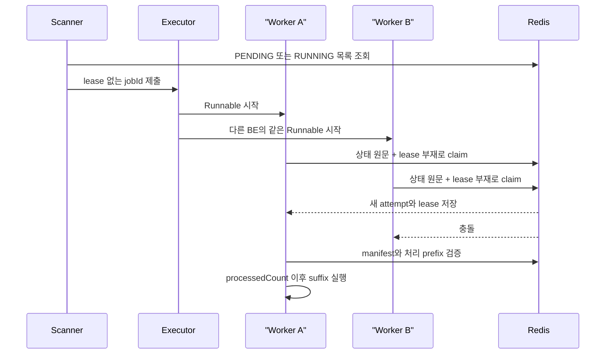

# Phase 6M-B — 문제 수집 만료 작업 자동 인계

## 문제

Phase 6M-A는 현재 worker의 Redis 상태 쓰기를 lease로 제한했지만, 다음 작업을
다시 실행할 주체는 없었다.

- 실행기가 요청을 거부한 `PENDING` 작업은 다시 제출되지 않았다.
- worker가 종료되어 lease가 사라진 `RUNNING` 작업은 같은 job 안에서 이어지지
  않았다.
- 새 worker가 전체 대상을 다시 실행하면 이미 처리한 외부 호출과 카운터가
  중복될 수 있었다.

이번 단계는 Redis index와 Phase 6L의 대상 manifest를 사용해 실행 주체가 없는
작업만 다시 제출하고, 저장된 처리 위치 다음 대상부터 이어서 실행한다.

## scanner와 claim 순서

기본 scanner 주기는 10초다. 후보 조회 결과는 실행 힌트일 뿐이며 소유권은
Runnable이 시작된 뒤 Redis Lua에서 결정한다.



executor 큐에 들어가기 전에 claim하지 않는다. 큐 대기 시간이 lease보다 길어져
실제 실행 전에 소유권이 만료되는 경우를 피하기 위해서다.

같은 JVM에서는 `scheduledJobIds`가 jobId의 중복 제출을 막는다. 여러 BE가 같은
작업을 제출할 수는 있지만 상태 원문과 lease 부재를 함께 확인하는 claim Lua에서
하나만 성공한다.

worker lease가 활성화된 상태에서 executor가 제출을 거부하면 상태, attempt,
lease를 바꾸지 않는다. local 제출 기록만 지우고 다음 scan에서 다시 시도한다.

## 인계 상태 검증

claim에 성공한 상태 원문을 `sourceJob`으로 보존하고 새 worker가 소유권을 얻은
뒤 다음 조건을 확인한다.

1. `processedCount`가 `0..totalCount` 범위에 있다.
2. `successCount + failCount == processedCount`다.
3. `processedCount == 0`이면 checkpoint가 없다.
4. 처리한 항목이 있으면 manifest의 `processedCount - 1` 위치가 checkpoint와
   같다.
5. 실패 Set의 원소 수가 `failCount`와 같다.
6. 모든 실패 ID가 manifest의 처리 완료 prefix 안에 있다.
7. manifest의 jobId, 작업 유형, 대상 수와 상태 참조 hash가 일치한다.

scanner가 읽은 오래된 상태를 미리 검증해 최신 작업을 종료하지 않도록 검증과
실패 전이는 claim 뒤 현재 worker의 owned CAS로 처리한다.

- manifest가 없으면 외부 호출 없이 `WORKER_UNAVAILABLE`로 종료한다.
- manifest나 진행 상태가 손상됐으면 claim 뒤 현재 attempt의 CAS로 외부 호출
  없이 `RESOURCE_STATE_CONFLICT`로 종료한다.
- 검증 중 일시적인 Redis 읽기 오류가 발생하면 `FAILED`로 바꾸지 않고 lease를
  내려 다음 scan에서 다시 시도한다.
- `attemptNumber`가 `Long.MAX_VALUE`면 더 큰 시도 번호를 만들지 않고 제출을
  건너뛴다.

## 작업 유형별 재개

manifest에서 `processedCount`만큼의 prefix를 제거한 뒤 남은 대상을 처리한다.
카운터는 0으로 초기화하지 않고 `sourceJob`의 값을 시작값으로 사용한다.

| 작업 유형 | 재개 기준 |
| --- | --- |
| `COLLECT_METADATA` | explicit ID suffix와 range suffix를 원래 순서로 연결 |
| `COLLECT_DETAILS` | manifest ID를 일괄 조회한 뒤 manifest 순서로 복원 |
| `REFRESH_DETAILS` | 처리 완료 prefix를 제외하고 남은 ID만 BOJ에서 다시 조회 |
| `UPDATE_LANGUAGE` | 남은 ID만 조회해 manifest 순서로 언어 갱신 |

비메타데이터 대상은 `findAllById` 반환 순서에 의존하지 않는다. 조회 결과를 ID로
매핑한 뒤 manifest 순서로 다시 배치한다. 인계 전에 문서가 삭제된 ID도 버리지
않고 실패 1건과 checkpoint를 기록하므로 마지막에는
`processedCount == totalCount`를 만족한다.

진행 상태는 한 항목마다 정확히 1 증가해야 하며 성공·실패 수는 감소할 수 없다.
현재 attempt와 lease가 일치하지 않으면 진행률, 실패 원장, 완료 상태를 쓰지
않는다.

## 설정

```yaml
app:
  problem-collector:
    worker-lease:
      enabled: false
      lease-duration: 90s
      heartbeat-interval: 20s
      scan-interval: 10s
```

환경 변수는 `PROBLEM_COLLECTOR_WORKER_SCAN_INTERVAL`을 사용한다. 단일 인스턴스
시작 복구와 worker lease는 함께 켤 수 없다.

## 검증

Docker의 Redis 7.2.5에서 신규 scanner·takeover는 별도 DB 8·9, 기존 lease
회귀는 DB 10으로 확인했다. 외부 solved.ac·BOJ 클라이언트와 MongoDB 저장소
호출은 MockK로 계측했다.

| 조건 | 결과 |
| --- | --- |
| executor가 첫 제출을 거부한 `PENDING` | 상태·attempt·lease 변경 0건, 다음 scan 완료 |
| 같은 JVM의 반복 scan | 대기 Runnable 1건 |
| 두 BE의 같은 `PENDING` claim | 외부 호출·저장 각 1건 |
| 두 BE의 같은 만료 `RUNNING` claim | attempt 증가 1회, suffix 외부 호출 1건 |
| hybrid metadata manifest의 처리 완료 prefix | prefix 호출 0건, 기존 카운터 보존 |
| 상세·새로고침·언어 manifest suffix | DB 전체 조회 0건, manifest 순서 유지 |
| suffix의 삭제된 상세 대상 | 실패 Set 1건, 최종 처리 수와 전체 대상 수 일치 |
| 유효한 lease의 `RUNNING` | executor 제출 0건, 상태·lease 원문 불변, PTTL 자연 감소 외 갱신 0건 |
| missing·hash 불일치 manifest | 외부 호출 0건, current-attempt CAS로 `RESOURCE_STATE_CONFLICT` |
| manifest 없는 기존 `RUNNING` | 기존 카운터·실패 Set 보존, `WORKER_UNAVAILABLE` |
| `attemptNumber=Long.MAX_VALUE` | executor 제출·상태 변경 0건 |

전체 결과:

아래 테스트 수는 `build/test-results/test`, `build/test-results/integrationTest`,
커버리지는 `jacocoMergedReport.xml`, `jacocoFullMergedReport.xml`에서 집계했다.

- Before main SHA: `f26b407a5c36cd6c6451b78f9f3bad126a717de8`
- Phase 6M-B 코드 SHA: `165e0fd8b23b8670920e5cd1445fe9467e8a8171`
- MongoDB: 7.0.16
- Redis: 7.2.5
- 단위 테스트: 753건 통과
- 통합 테스트: 267건 중 258건 통과, 조건부 9건 제외
- core-v1 Line / Branch / Method: 88.99% / 66.78% / 87.65%
- full-v1 Line / Branch / Method: 78.87% / 61.69% / 79.46%
- `clean check`, core·full JaCoCo 기준 통과
- 독립 코드·설계 감사에서 잔여 P1·P2 없음

단위 테스트는 750건에서 753건, 통합 테스트는 252건에서 267건으로 늘었다.
collector가 core-v1 집계에서 제외되어 core 수치는 같고, full-v1은
Line 78.69% → 78.87%, Branch 61.36% → 61.69%, Method 79.26% → 79.46%로
바뀌었다.

이번 변경은 응답 시간이나 처리량을 줄이는 최적화가 아니라 작업 정합성을 다루므로
성능 개선율은 기록하지 않는다.

재현 명령:

```bash
SPRING_DATA_MONGODB_URI=mongodb://127.0.0.1:27218/didimlog-test \
TEST_MONGO_PORT=27218 \
TEST_REDIS_PORT=6398 \
SPRING_DATA_REDIS_HOST=127.0.0.1 \
SPRING_DATA_REDIS_PORT=6398 \
./gradlew clean check
```

## 남은 한계

- worker lease와 자동 인계는 Redis 작업 상태·실패 원장만 보호한다.
- lease 만료 전에 시작한 외부 HTTP 호출이나 MongoDB 쓰기 한 건은 끝날 수 있다.
  새 worker가 같은 manifest 항목을 다시 처리할 수 있으므로 exactly-once를
  보장하지 않는다.
- 신·구 worker 혼합 실행은 지원하지 않는다.
- scanner는 현재 작업 index 전체를 읽는다. 장기 보존 작업이 크게 늘어나는 운영
  환경에서는 별도 활성 작업 index가 필요할 수 있다.
- 여러 key를 다루는 Lua는 standalone Redis 구성을 기준으로 한다.
