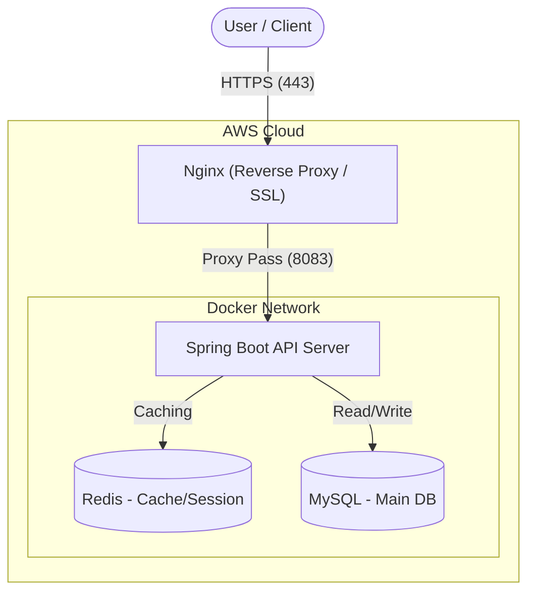

<div align="center">

  

# DidimLog : Backend API Server

**"이런 나라도 PS 알고리즘을 체계적으로 잘 풀 수 있지 않을까?"**

  <br>

디딤로그(DidimLog)의 **백엔드 API 서버** 저장소입니다.<br>
사용자의 문제 풀이 학습을 기록하고, 개인화된 피드백과 회고 데이터를 관리합니다.

  <br>

  
  
  
  

</div>

<br>

## 📚 API Documentation (API 명세서)

프론트엔드와의 협업 및 API 스펙 관리를 위해 마크다운 기반의 API 명세서를 제공합니다.<br>
프로젝트 내 `DOCS/API_SPECIFICATION.md` 파일에서 최신 API 명세를 확인하실 수 있습니다.

[](./DOCS/API_SPECIFICATION.md)

<br>

## 🏗️ System Architecture

DidimLog 백엔드는 안정적인 서비스 제공을 위해 **AWS EC2** 기반의 인프라를 구축하였으며,<br>
**Docker**를 활용한 컨테이너 환경에서 운영됩니다.



<br>

## 🛠 Tech Stack

| Category | Technology | Description |
| :--- | :--- | :--- |
| **Language** | **Kotlin** | Null Safety와 간결한 문법을 통한 생산성 향상 |
| **Framework** | **Spring Boot 3.x** | 엔터프라이즈급 애플리케이션 구축을 위한 프레임워크 |
| **Database** | **MongoDB** | 사용자, 문제, 회고 데이터 등 핵심 도메인 데이터 저장 |
| **Cache** | **Redis** | 세션 스토리지 및 자주 조회되는 랭킹/문제 데이터 캐싱 |
| **Infra** | **AWS EC2** | 클라우드 컴퓨팅 환경 |
| **DevOps** | **Docker & Actions** | 컨테이너 기반 배포 및 CI/CD 파이프라인 구축 |

<br>

## 🚀 Getting Started (시작 가이드)

로컬 환경에서 프로젝트를 실행하기 위한 방법입니다.

### Prerequisites

* JDK 17 이상
* Docker & Docker Compose (권장)
* MongoDB / Redis (로컬 설치 시)

### 1\. Repository Clone

```bash
git clone [https://github.com/didim-log/didim-log-be.git](https://github.com/didim-log/didim-log-be.git)
cd didim-log-be
```

### 2\. Environment Setup (.env)

프로젝트 루트 경로에 `.env` 파일을 생성하고 아래 환경 변수를 설정해야 합니다.

```properties
# MongoDB
SPRING_DATA_MONGODB_URI=mongodb://localhost:27017/didimlog

# Redis
REDIS_HOST=localhost
REDIS_PORT=6379

# JWT & Security
JWT_SECRET=your_secret_key_should_be_long_enough

# Admin
ADMIN_SECRET_KEY=your_admin_secret_key

# CORS
CORS_ALLOWED_ORIGINS=http://localhost:3000,http://localhost:5173

# OAuth2
OAUTH_GOOGLE_ID=...
OAUTH_GOOGLE_SECRET=...
OAUTH_GITHUB_ID=...
OAUTH_GITHUB_SECRET=...
OAUTH_NAVER_ID=...
OAUTH_NAVER_SECRET=...
OAUTH_REDIRECT_URI=http://localhost:5173/oauth/callback

# Mail (SMTP)
MAIL_USERNAME=didimlognoreply@gmail.com
MAIL_PASSWORD=your_app_password

# AI (optional)
AI_ENABLED=false
GEMINI_API_KEY=
GEMINI_API_URL=https://generativelanguage.googleapis.com/v1beta/models/gemini-2.0-flash:generateContent

# App (optional)
SERVER_URL=http://localhost:8080
```

### 3\. Run Application

**Gradle Wrapper**를 사용하여 애플리케이션을 실행합니다.

```bash
./gradlew bootRun
```

<br>

## ✅ Deployment Checklist (배포 체크리스트)

배포 전 점검 항목은 `DOCS/DEPLOYMENT_CHECKLIST.md`를 참고하세요.

<br>

## ✅ Core Features (핵심 기능)

1.  **회고 및 학습 관리 (Log & Retrospect)**
    * Markdown 에디터 기반의 회고 작성 기능
    * 문제 풀이 시간 및 정오답 기록 저장
2.  **단계별 문제 추천 (Step-by-Step)**
    * 사용자 티어(Tier) 기반 맞춤형 알고리즘 문제 제공
3.  **대시보드 (Dashboard)**
    * 학습 현황, 최근 풀이 기록, 성장 그래프 시각화 데이터 제공

<br>

## 🤝 Contribution

1.  **Fork** the project
2.  Create your feature branch (`git checkout -b feat/AmazingFeature`)
3.  **Commit** your changes (`git commit -m 'feat: Add some AmazingFeature'`)
4.  **Push** to the branch (`git push origin feat/AmazingFeature`)
5.  Open a **Pull Request**

> 커밋 메시지 컨벤션은 [AngularJS Git Commit Message Conventions](https://www.google.com/search?q=https://github.com/angular/angular.js/blob/master/DEVELOPERS.md%23-git-commit-guidelines)를 따릅니다.

<br>

<div align="center">
Copyright © 2025 DidimLog Team. All rights reserved.
</div>