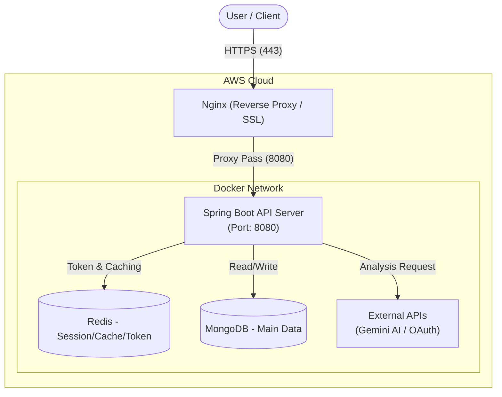

<div align="center">

  

# DidimLog : Backend API Server

**"PS(Problem Solving) 알고리즘 학습의 길잡이, 디딤로그"**

  <br>

디딤로그(DidimLog)의 **백엔드 API 서버** 저장소입니다.<br>
사용자의 문제 풀이 활동을 기록하고, **AI 기반 코드 분석**과 **시각화된 통계**를 통해 성장을 지원합니다.

  <br>

  
  
  
  
  

</div>

<br>

## 📚 API Documentation

프론트엔드와의 원활한 협업을 위해 최신 API 명세서를 제공합니다.<br>
`DOCS/API_SPECIFICATION.md`에서 상세 엔드포인트와 요청/응답 예시를 확인할 수 있습니다.

[](./DOCS/API_SPECIFICATION.md)

<br>

## 🏗️ System Architecture

안정적인 서비스 제공을 위해 **AWS EC2** 인프라 위에서 **Docker** 컨테이너 기반으로 운영됩니다.<br>
데이터 무결성과 성능을 위해 **MongoDB**와 **Redis**를 함께 사용합니다.



## ✅ Core Features (핵심 기능)

최근 업데이트를 통해 학습 경험과 보안성을 대폭 강화했습니다.

### 1. **AI 코드 리뷰 & 회고 (AI-Powered Retrospective)**
* **Google Gemini 2.5 Flash** 모델을 활용하여 제출된 코드의 시간 복잡도, 공간 복잡도, 개선점을 분석합니다.
* Markdown 에디터를 통해 AI 분석 결과를 기반으로 나만의 회고를 작성할 수 있습니다.
* AI 사용량 제한 시스템(Circuit Breaker)으로 서비스 안정성을 보장합니다.

### 2. **시각화된 학습 통계 (Visual Analytics)**
* **잔디(Contribution Heatmap):** 연도별 학습 지속성을 히트맵으로 시각화하여 동기를 부여합니다.
* **실력 분석:** 레이더 차트(Radar Chart)를 통해 알고리즘 유형별 강점과 약점을 한눈에 파악합니다.
* **취약점 진단:** 자주 실패하는 알고리즘 유형을 분석하여 제공합니다.
* **백엔드 집계:** 모든 통계 데이터는 백엔드에서 집계되어 프론트엔드에 전달됩니다.

### 3. **강력한 보안 시스템 (Enhanced Security)**
* **JWT Refresh Token Rotation:** 토큰 탈취 위협을 방지하고 안전한 로그인 세션을 유지합니다.
* **Defense in Depth:** 관리자 기능에 대한 이중 보안 검증(URL 패턴 + 메서드 레벨) 및 입력값 검증(Validation)을 적용했습니다.
* **OAuth2 소셜 로그인:** Google, GitHub, Naver 지원
* **BOJ 인증:** Solved.ac 연동을 통한 실명 인증

### 4. **단계별 문제 추천 (Step-by-Step)**
* 사용자의 현재 티어(Tier)와 실력을 고려하여 맞춤형 알고리즘 문제를 추천합니다.
* 무한 성장(Continuous Growth) 로직을 지원하여 최대 티어에 도달해도 상위 난이도 문제를 추천합니다.

### 5. **관리자 대시보드 (Admin Dashboard)**
* 시스템 모니터링: RPM(분당 요청 수), 평균 응답 시간 추적
* AI 서비스 제어: 사용량 제한, 글로벌/유저별 할당량 관리
* 저장 공간 관리: 오래된 데이터 정리 및 통계
* 감사 로그: 모든 관리자 작업 기록

<br>

## 🛠 Tech Stack

| Category | Technology | Description |
| --- | --- | --- |
| **Language** | **Kotlin** | Null Safety와 간결한 문법, 코루틴 활용 |
| **Framework** | **Spring Boot 3.3.5** | 최신 스프링 부트 기반의 견고한 백엔드 구축 |
| **Database** | **MongoDB** | 유연한 스키마(회고, 문제 데이터) 처리에 최적화 |
| **Cache & Auth** | **Redis** | Refresh Token 저장소 및 데이터 캐싱, AI 사용량 추적 |
| **Security** | **Spring Security & JWT** | Stateless 인증 및 권한 관리, OAuth2 소셜 로그인 |
| **AI** | **Google Gemini 2.5 Flash** | 코드 분석 및 회고 생성 |
| **DevOps** | **Docker & Actions** | 컨테이너화 및 CI/CD 자동화 |

<br>

## 🚀 Getting Started

로컬 개발 환경 설정을 위한 가이드입니다.

### Prerequisites

* JDK 17+
* Docker & Docker Compose
* MongoDB, Redis (Docker 실행 권장)

### 1. Repository Clone

```bash
git clone https://github.com/didim-log/didim-log-BE.git
cd didim-log-BE
```

### 2. Environment Setup (.env)

프로젝트 루트에 `.env` 파일을 생성하고 설정을 입력합니다.

```properties
# --- Database ---
SPRING_DATA_MONGODB_URI=mongodb://localhost:27017/didimlog
REDIS_HOST=localhost
REDIS_PORT=6379

# --- Security & JWT ---
JWT_SECRET=your_very_long_secret_key_for_signing
ADMIN_SECRET_KEY=your_admin_registration_key

# --- OAuth2 (Social Login) ---
OAUTH_GOOGLE_ID=...
OAUTH_GOOGLE_SECRET=...
OAUTH_GITHUB_ID=...
OAUTH_GITHUB_SECRET=...
OAUTH_NAVER_ID=...
OAUTH_NAVER_SECRET=...
OAUTH_REDIRECT_URI=http://localhost:5173/oauth/callback

# --- AI Service (Gemini) ---
AI_ENABLED=true
GEMINI_API_KEY=your_gemini_api_key
GEMINI_API_URL=https://generativelanguage.googleapis.com/v1beta/models/gemini-2.5-flash:generateContent

# --- System ---
CORS_ALLOWED_ORIGINS=http://localhost:3000,http://localhost:5173
SERVER_URL=http://localhost:8080
MAIL_USERNAME=didimlognoreply@gmail.com
MAIL_PASSWORD=your_app_password
```

### 3. Run Application

```bash
# Run with Gradle Wrapper
./gradlew bootRun
```

또는 Docker Compose를 사용하여 전체 스택을 실행할 수 있습니다:

```bash
docker-compose up -d
```

<br>

## 📋 Code Style & Guidelines

이 프로젝트는 **'우아한 테크코스' 클린 코드 원칙**을 엄격하게 준수합니다.

* **Indent Depth 1**: 중첩을 최소화하고 메서드로 분리
* **No `else` Keyword**: Early Return 패턴 사용
* **Primitive Wrapping**: 모든 원시값을 Value Object로 포장
* **First Class Collection**: 일급 컬렉션 사용
* **Max 3 Instance Variables**: 클래스당 최대 3개의 인스턴스 변수
* **No Getter/Setter**: 객체에 메시지를 보내는 방식

자세한 내용은 `DOCS/PR_GUIDE.md`를 참고하세요.

<br>

## 🤝 Contribution

1. **Fork** the project
2. Create your feature branch (`git checkout -b feat/AmazingFeature`)
3. **Commit** your changes (`git commit -m 'feat: Add some AmazingFeature'`)
4. **Push** to the branch (`git push origin feat/AmazingFeature`)
5. Open a **Pull Request**

> 커밋 메시지는 [AngularJS Commit Convention](./DOCS/COMMIT_CONVENTION.md)을 준수합니다.

<br>

## 📝 Related Documents

* [API 명세서](./DOCS/API_SPECIFICATION.md) - 모든 REST API 엔드포인트 상세 설명
* [커밋 컨벤션](./DOCS/COMMIT_CONVENTION.md) - Git 커밋 메시지 규칙
* [PR 가이드](./DOCS/PR_GUIDE.md) - 코드 스타일 및 PR 작성 가이드
* [추천 로직](./DOCS/RECOMMENDATION_LOGIC.md) - 문제 추천 알고리즘 설명

<br>

<div align="center">
Copyright © 2026 DidimLog Team. All rights reserved.
</div>
