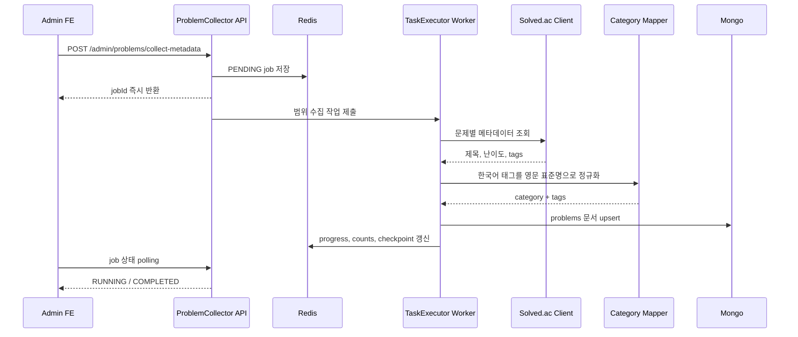
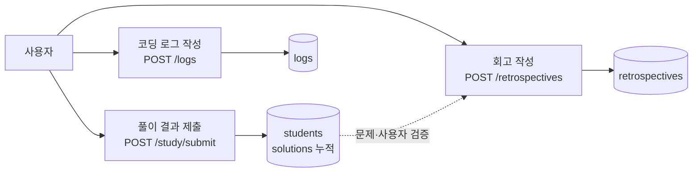

# DidimLog Backend API Server

> 알고리즘 문제 풀이 결과와 코드를 기록하고, 회고·통계·AI 피드백으로 학습 과정을 연결하는 백엔드 서비스입니다.

## 1. 프로젝트 소개

DidimLog는 문제를 풀고 끝내는 대신 풀이 결과, 소요 시간, 코드, 회고를 하나의 학습 기록으로 남길 수 있도록 설계했습니다. 문제 메타데이터와 본문은 별도의 수집 파이프라인으로 관리하고, 사용자 기록은 MongoDB 문서로 저장해 통계와 검색에 활용합니다.

| 항목 | 내용 |
| --- | --- |
| 개발 기간 | 2026.02 ~ 진행 중 |
| 개발 인원 | 백엔드 1명 |
| 담당 | 도메인·API 설계, 인증/인가, 문제 수집, 풀이 기록, 회고, AI 리뷰, 운영 도구 |
| Backend | [didim-log/didim-log-BE](https://github.com/didim-log/didim-log-BE) |

DidimLog 자체에서 코드를 컴파일하거나 온라인 채점을 수행하지는 않습니다. 사용자가 입력한 성공 여부와 소요 시간을 풀이 기록으로 저장하고, 이후 로그와 회고 작성 흐름으로 연결합니다.

## 2. 기술 스택

| Category | Tech Stack | Version | Decision Reason |
| --- | --- | --- | --- |
| Language | Kotlin | 1.9.25 | Null Safety와 도메인 모델 표현력을 활용해 비즈니스 규칙을 명시적으로 표현 |
| Framework | Spring Boot, WebFlux, Security | 3.3.5 | 동기 API, 외부 HTTP 연동, JWT 인증과 관리자 권한을 일관된 구조로 관리 |
| Database | MongoDB | - | 문제·사용자 풀이·로그·회고처럼 형태가 다른 문서를 유연하게 저장 |
| Cache / State | Redis | - | Refresh Token, Rate Limit, 수집 작업 상태와 TTL 데이터 관리 |
| External | Solved.ac, BOJ, Gemini, OAuth2 | - | 문제 메타데이터·본문 수집, AI 피드백, 소셜 로그인 연동 |
| Infra | Docker, Docker Compose, AWS EC2, Nginx | - | 실행 환경 표준화와 배포 구성 관리 |

## 3. 시스템 아키텍처


```mermaid
flowchart LR
    FE["React Web Client"]
    SECURITY["Spring Security<br/>JWT Filter"]
    API["Spring Boot API"]
    COLLECTOR["Problem Collector<br/>TaskExecutor"]
    MONGO[("MongoDB")]
    REDIS[("Redis")]
    SOLVED["Solved.ac API"]
    BOJ["BOJ Problem Page"]
    GEMINI["Gemini API"]
    OAUTH["OAuth Providers"]

    FE --> SECURITY --> API
    API --> MONGO
    API --> REDIS
    API --> COLLECTOR
    COLLECTOR --> SOLVED
    COLLECTOR --> BOJ
    COLLECTOR --> MONGO
    COLLECTOR --> REDIS
    API --> GEMINI
    API --> OAUTH
```

### 설계 기준

- `ui → application → domain → infra` 방향으로 유스케이스와 외부 의존성을 분리했습니다.
- 관리자 문제 수집은 요청과 작업 실행을 분리하고, Redis에 진행 상태·성공/실패 수·checkpoint를 기록합니다.
- 문제, 사용자 풀이, 로그, 회고는 목적이 다른 MongoDB 문서로 관리합니다.
- AI 리뷰는 MongoDB `findAndModify` 기반 잠금으로 동일 로그의 중복 생성을 제어합니다.

## 4. 담당 기능과 핵심 구현

### 문제 데이터 수집과 운영 제어

- Solved.ac 문제 메타데이터 수집과 MongoDB upsert
- BOJ 문제 본문·입력·출력·예제 HTML 수집
- Redis 기반 작업 상태, TTL, sorted index, 진행률, heartbeat, checkpoint
- 관리자 작업 목록·취소·재시도·감사 로그·운영 메트릭 API

### 학습 기록

- 풀이 성공 여부와 소요 시간을 사용자 문서에 누적
- 제목·본문·코드를 포함한 코딩 로그 저장
- 문제별 회고 생성·수정과 중복 생성 경쟁 처리
- 카테고리·풀이 전략·북마크 기반 회고 검색

### 인증과 운영 안정성

- JWT Access Token과 Redis Refresh Token 저장소 분리
- OAuth2 로그인과 USER / ADMIN 권한 분리
- 인증 API별 Redis Rate Limit과 TTL 기반 차단
- AI 리뷰 잠금, 실패 상태 전환, 재시도 흐름

## 5. 핵심 데이터 흐름

### 5-1. 메타데이터 수집·정규화·MongoDB 저장

카테고리는 독립된 크롤러가 수집하는 값이 아닙니다. Solved.ac 문제 메타데이터의 태그를 가져오는 과정에서 함께 정규화해 저장합니다.


```mermaid
sequenceDiagram
    participant Admin as Admin FE
    participant API as ProblemCollector API
    participant Redis
    participant Worker as TaskExecutor Worker
    participant Solved as Solved.ac Client
    participant Mapper as Category Mapper
    participant Mongo

    Admin->>API: POST /admin/problems/collect-metadata
    API->>Redis: PENDING job 저장
    API-->>Admin: jobId 즉시 반환
    API->>Worker: 범위 수집 작업 제출
    Worker->>Solved: 문제별 메타데이터 조회
    Solved-->>Worker: 제목, 난이도, tags
    Worker->>Mapper: 한국어 태그를 영문 표준명으로 정규화
    Mapper-->>Worker: category + tags
    Worker->>Mongo: problems 문서 upsert
    Worker->>Redis: progress, counts, checkpoint 갱신
    Admin->>API: job 상태 polling
    API-->>Admin: RUNNING / COMPLETED
```

정규화 단계에서는 한국어 `displayName`을 `ProblemCategory`의 영문 표준명으로 변환합니다. 첫 번째 정규화 태그는 대표 `category`, 전체 태그는 `tags` 배열에 저장합니다.

### 5-2. 카테고리 계층 확장 검색

카테고리 계층은 외부 사이트에서 다시 크롤링하지 않고 애플리케이션에 정의한 부모·자식·연관 관계를 사용합니다.

1. `GET /api/v1/problems/categories/meta`가 정규 이름, 별칭, 부모·자식·연관 카테고리를 제공합니다.
2. `EXACT`는 대표 카테고리를 정확히 비교합니다.
3. `HIERARCHY`는 선택 카테고리와 하위 태그를 확장합니다.
4. `RELATED`는 계층 결과에 부모·형제 관계를 더합니다.
5. MongoDB의 `category`와 `tags`를 조회해 추천 후보를 구성합니다.

### 5-3. 풀이 결과·로그·회고 저장


```mermaid
flowchart LR
    USER["사용자"]
    STUDY["풀이 결과 제출<br/>POST /study/submit"]
    STUDENT[("students<br/>solutions 누적")]
    LOG_API["코딩 로그 작성<br/>POST /logs"]
    LOGS[("logs")]
    RETRO_API["회고 작성<br/>POST /retrospectives"]
    RETROS[("retrospectives")]

    USER --> STUDY --> STUDENT
    USER --> LOG_API --> LOGS
    USER --> RETRO_API --> RETROS
    STUDENT -. 문제·사용자 검증 .-> RETRO_API
```

- 풀이 제출 시 JWT의 BOJ ID로 사용자를 찾고, 문제 존재 여부를 확인한 뒤 성공 여부와 소요 시간을 사용자 문서에 저장합니다.
- 코딩 로그는 제목, 내용, 코드, 성공 여부를 별도 문서로 저장합니다.
- 회고는 사용자·문제를 검증한 뒤 문제별로 생성하거나 기존 문서를 갱신합니다.

## 6. 화면으로 확인하기

| GIF | 기능 요약 |
| --- | --- |
| `02` | 관리자 비동기 수집 → Redis 작업 상태 → MongoDB upsert → 문제 상세 확인 |
| `04` | Solved.ac 태그 정규화 → 대표·보조 카테고리 저장 → 계층 확장 검색 |

### 비동기 문제 수집 파이프라인

관리자 화면에서 메타데이터 수집과 상세 정보 수집을 실행하고, Redis 작업 상태와 MongoDB 저장 결과를 실제 FE 문제 상세 화면까지 연결합니다.


### 카테고리 메타데이터 수집과 계층 검색

6개 문제의 태그를 정규화해 MongoDB에 저장한 뒤, 실제 문제 목록 화면에서 계층 확장 검색과 대표·보조 카테고리 표시를 확인합니다.


> 두 GIF는 외부 BOJ/Solved.ac 응답만 `portfolio-fixture`의 고정 응답으로 대체했습니다. React FE, Spring Boot BE, Redis 작업 상태, MongoDB 문서 저장, JWT 발급·검증은 로컬 환경에서 실제로 실행했습니다.

## 7. 로컬 검증 결과

### 카테고리 메타데이터 파이프라인

| 검증 항목 | 결과 |
| --- | --- |
| 수집 시작 API 응답 | 121 ms |
| 처리 범위 | 문제 1000~1005 |
| 최종 작업 상태 | `COMPLETED` |
| 처리 / 성공 / 실패 | 6 / 6 / 0 |
| 마지막 checkpoint | `1005` |
| MongoDB 저장 | 6개 문제의 `category`, `tags`, `level` 확인 |
| 브라우저 오류 | console / page / request error 0건 |

이 결과는 반복 촬영을 위한 local fixture 검증이며, 실제 Solved.ac·BOJ 네트워크 응답 시간이나 운영 처리량을 의미하지 않습니다.

### 로컬 성능 검증

| 측정 항목 | 조건 | 결과 |
| :--- | :--- | :--- |
| 조회 API | 10 VUs · 1분 | 5,431 requests · 90.41 RPS · P95 13.894 ms |
| 응답 안정성 | Dashboard · Statistics · 회고 목록·상세 | HTTP 실패율 0% · Check 성공률 100% |
| AI 회고 동시 요청 | 동일 로그 50건 · 10회 반복 | 모든 회차 Gemini 호출 1회 |
| AI 회고 저장 | 동시 요청 50건 · 10회 반복 | 최종 저장 1건 · 중복 저장 0건 |
| AI 작업 상태 | 성공 및 실패 후 재시도 | 최종 `COMPLETED` · Lock 잔존 0건 |
| 회원가입 Rate Limit | 시간당 5건 | 5건 허용 · 이후 2건 차단 |
| 로그인 Rate Limit | 시간당 10건 | 10건 허용 · 이후 2건 차단 |
| 비밀번호 재설정 Rate Limit | 시간당 3건 | 3건 허용 · 이후 2건 차단 |

> 로컬 MongoDB·Redis와 Gemini Mock을 사용한 합성 환경의 검증 결과이며, 운영 처리량이나 성능 개선율을 의미하지 않습니다.

[상세 실행 조건과 결과](./DOCS/performance/runs/2026-06-21-DIDIMLOG-LOCAL-VERIFICATION.md)

## 8. 트러블 슈팅

### AI 리뷰 중복 생성 및 동시성 제어

- 문제: 동일 로그에 짧은 시간 동안 요청이 집중되면 AI API 호출과 최종 저장이 중복될 수 있었습니다.
- 해결: MongoDB `findAndModify`로 `IN_PROGRESS` 잠금을 원자적으로 획득하고, 완료·실패 상태와 잠금 만료 시각을 함께 관리했습니다.
- 검증: 동일 로그 50건 동시 요청을 10회 반복했을 때 각 회차의 Gemini 호출과 최종 저장이 각각 1건으로 수렴했습니다.

### 문제 수집 작업의 비동기 실행

- 문제: 같은 클래스의 `private @Async` 메서드는 Spring proxy를 거치지 않아 HTTP 요청을 차단할 수 있습니다.
- 해결: 명시적으로 주입한 `TaskExecutor`에 수집 작업을 제출하고, API는 Redis job 생성 후 `jobId`를 반환하도록 분리했습니다.
- 결과: 관리자 화면은 상태 API를 polling하며 진행률과 checkpoint를 갱신합니다.

### 인증 API 남용 방지

- Redis 카운터와 TTL로 회원가입, 로그인, 비밀번호 재설정의 호출 횟수를 제한합니다.
- 제한 초과 시 해제 예정 시각을 응답해 클라이언트가 재시도 시점을 안내할 수 있도록 했습니다.

## 9. 실행 및 테스트

### 로컬 실행

MongoDB와 Redis 연결 정보, JWT Secret, OAuth·메일의 로컬 설정을 환경 변수로 준비한 뒤 실행합니다.

```bash
./gradlew bootRun
```

외부 BOJ/Solved.ac 응답을 사용하지 않는 포트폴리오 촬영 환경에서는 로컬 전용 프로필을 활성화합니다.

```bash
SPRING_PROFILES_ACTIVE=portfolio-fixture ./gradlew bootRun
```

`portfolio-fixture` 구성은 `prod`와 동시에 활성화될 경우 고정 인증 코드와 외부 fixture client가 동작하지 않도록 제한했습니다.

### 테스트

```bash
./gradlew test
./gradlew integrationTest
./gradlew check
./gradlew jacocoTestReport jacocoIntegrationTestReport jacocoMergedReport
```

## 10. 한계와 검증 범위

- DidimLog는 온라인 채점 시스템이 아닙니다. 풀이 성공 여부와 소요 시간은 사용자가 제출한 값을 기록합니다.
- 카테고리는 별도 크롤러가 아니라 Solved.ac 메타데이터의 태그를 정규화한 결과입니다.
- 부모·자식·연관 카테고리 계층은 코드로 관리하므로 외부 분류 체계 변경 시 함께 갱신해야 합니다.
- GIF의 외부 BOJ/Solved.ac 응답은 재현 가능한 fixture이며, 실제 외부 연동 성공을 증명하지 않습니다.
- 성능 수치는 로컬 합성 환경의 결과로 운영 성능이나 개선율로 해석할 수 없습니다.
- BOJ HTML 구조나 외부 API 계약이 변경되면 파서와 응답 모델 보완이 필요할 수 있습니다.

## 11. 문서

- [API 명세](./DOCS/API_SPECIFICATION.md)
- [Clean Code 원칙](./DOCS/CLEAN_CODE_PRINCIPLES.md)
- [PR 가이드](./DOCS/PR_GUIDE.md)
- [커밋 컨벤션](./DOCS/COMMIT_CONVENTION.md)
- [로컬 성능 검증 상세 결과](./DOCS/performance/runs/2026-06-21-DIDIMLOG-LOCAL-VERIFICATION.md)

## 12. 배포 순서

템플릿 category 레거시 alias 제거가 반영되어, 호환성 기준으로 프론트엔드 선배포 후 백엔드 배포를 권장합니다.
