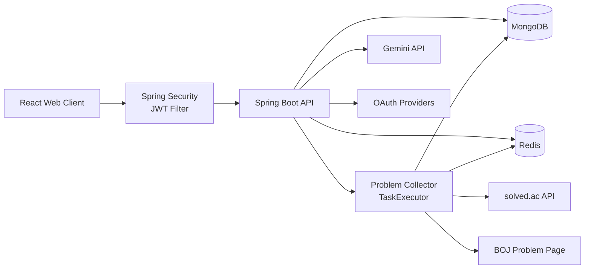
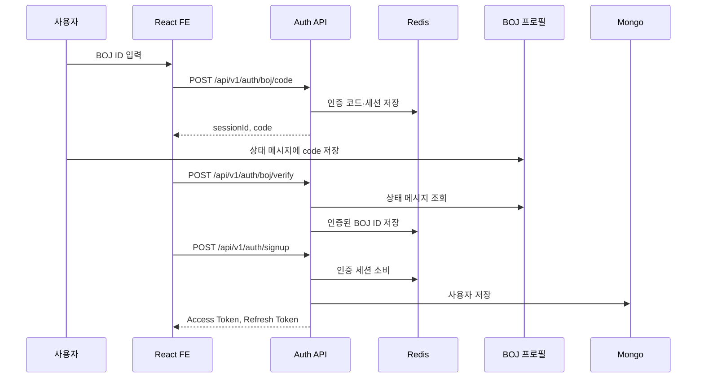
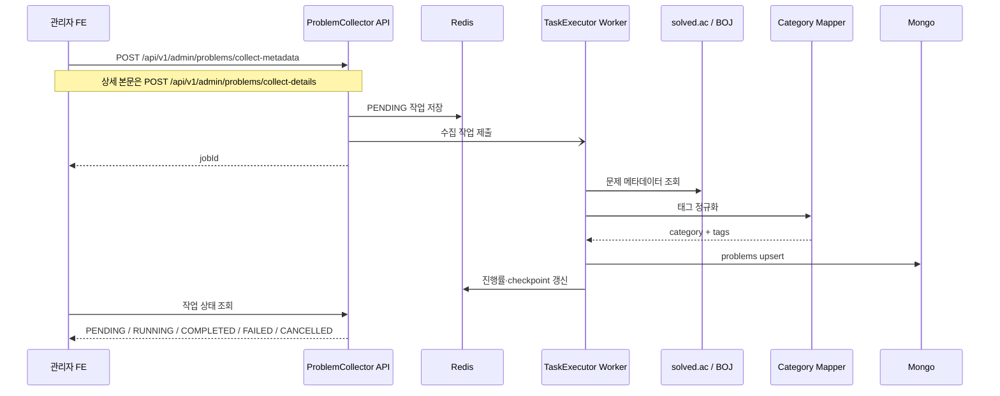
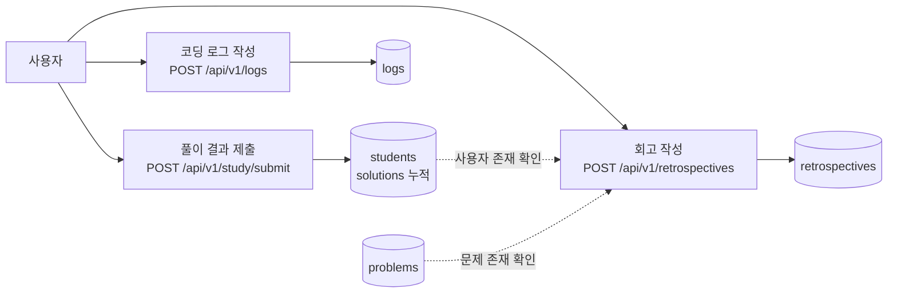
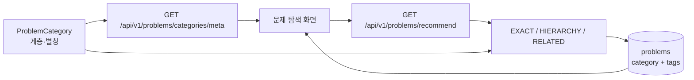
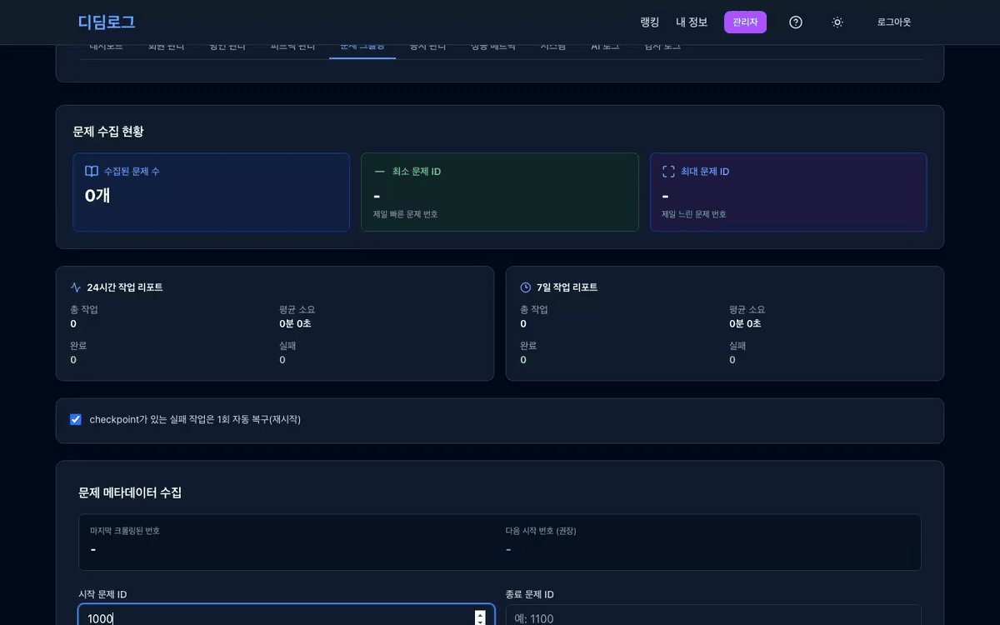
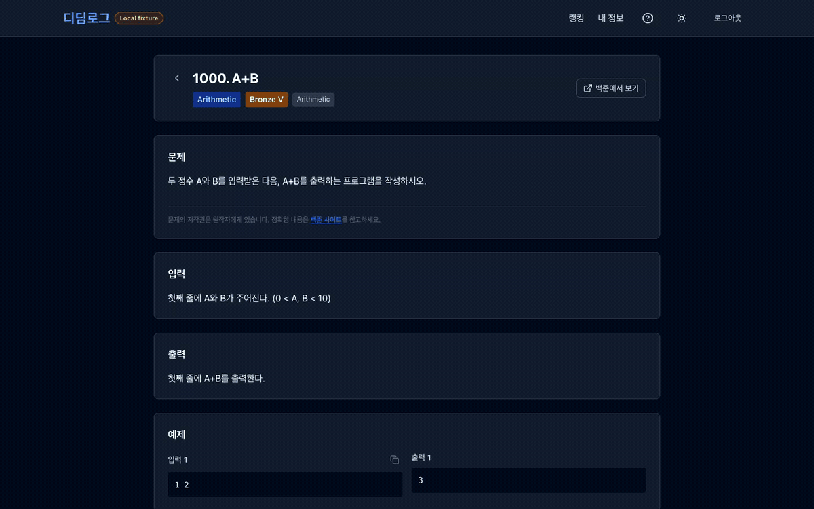
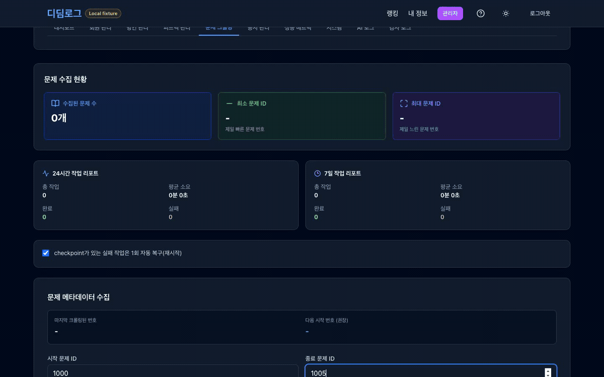
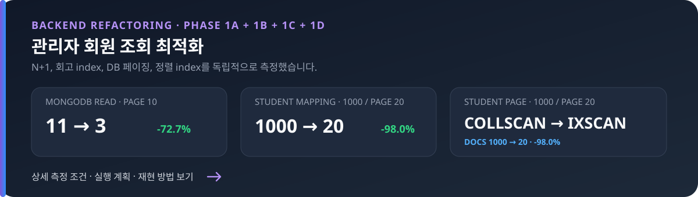

# DidimLog Backend API Server

> 알고리즘 문제 풀이 결과와 코드를 기록하고, 회고·통계·AI 피드백으로 학습 과정을 연결하는 백엔드 서비스입니다.

## 1. 프로젝트 소개

DidimLog는 문제를 풀고 끝내는 대신 풀이 결과, 소요 시간, 코드, 회고를 하나의 학습 기록으로 남길 수 있도록 설계했습니다. 문제 메타데이터와 본문은 별도의 수집 파이프라인으로 관리하고, 사용자 기록은 MongoDB 문서로 저장해 통계와 검색에 활용합니다.

| 항목 | 내용 |
| --- | --- |
| 개발 기간 | 2026.02 ~ 진행 중 |
| 개발 인원 | 백엔드 1명 |
| 담당 | 도메인·API 설계, 인증/인가, 문제 수집, 풀이 기록, 회고, AI 리뷰, 운영 도구 |
| Backend | [didim-log/didim-log-BE](https://github.com/didim-log/didim-log-BE) |
| Frontend | [didim-log/didim-log-FE](https://github.com/didim-log/didim-log-FE) |

DidimLog 자체에서 코드를 컴파일하거나 온라인 채점을 수행하지는 않습니다. 사용자가 입력한 성공 여부와 소요 시간을 풀이 기록으로 저장하고, 이후 로그와 회고 작성 흐름으로 연결합니다.

## 2. 기술 스택

| Category | Tech Stack | Version | Decision Reason |
| --- | --- | --- | --- |
| Language | Kotlin | 1.9.25 | Null Safety와 도메인 모델 표현력을 활용해 비즈니스 규칙을 명시적으로 표현 |
| Framework | Spring Boot, Spring MVC, WebClient, Spring Security | 3.3.5 | MVC API, 외부 HTTP 호출, JWT 인증·인가 구성 |
| Database | MongoDB | - | 문제·사용자 풀이·로그·회고처럼 형태가 다른 문서를 유연하게 저장 |
| Cache / State | Redis | - | Refresh Token, Rate Limit, 수집 작업 상태와 TTL 데이터 관리 |
| External | solved.ac, BOJ, Gemini, OAuth2 | - | 문제 메타데이터·본문 수집, AI 피드백, 기존 연결 계정 로그인 |
| Infra | Docker, Docker Compose, AWS EC2, Nginx | - | 실행 환경 표준화와 배포 구성 관리 |

## 3. 시스템 아키텍처


```mermaid
flowchart LR
    FE["React Web Client"]
    SECURITY["Spring Security<br/>JWT Filter"]
    API["Spring Boot API"]
    COLLECTOR["Problem Collector<br/>TaskExecutor"]
    MONGO[("MongoDB")]
    REDIS[("Redis")]
    SOLVED["solved.ac API"]
    BOJ["BOJ Problem Page"]
    GEMINI["Gemini API"]
    OAUTH["OAuth Providers"]

    FE --> SECURITY --> API
    API --> MONGO
    API --> REDIS
    API --> COLLECTOR
    COLLECTOR --> SOLVED
    COLLECTOR --> BOJ
    COLLECTOR --> MONGO
    COLLECTOR --> REDIS
    API --> GEMINI
    API --> OAUTH
```

### 설계 기준

- `ui → application → domain → infra` 방향으로 유스케이스와 외부 의존성을 분리했습니다.
- 관리자 문제 수집은 요청과 작업 실행을 분리하고, Redis에 진행 상태·성공/실패 수·checkpoint를 기록합니다.
- 문제, 사용자 풀이, 로그, 회고는 목적이 다른 MongoDB 문서로 관리합니다.
- AI 리뷰는 MongoDB `findAndModify` 기반 잠금으로 동일 로그의 중복 생성을 제어합니다.

## 4. 담당 기능과 핵심 구현

### 문제 데이터 수집과 운영 제어

- solved.ac 문제 메타데이터 수집과 MongoDB upsert
- BOJ 문제 본문·입력·출력·예제 HTML 수집
- Redis 기반 작업 상태, TTL, sorted index, 진행률, heartbeat, checkpoint
- 관리자 작업 목록·취소·재시도·감사 로그·운영 메트릭 API

### 학습 기록

- 풀이 성공 여부와 소요 시간을 사용자 문서에 누적
- 제목·본문·코드를 포함한 코딩 로그 저장
- 학생·문제 기준 기존 회고 조회 후 생성·수정
- 카테고리·풀이 전략·북마크 기반 회고 검색

### 인증과 운영 안정성

- BOJ 프로필 상태 메시지를 이용한 계정 소유권 인증
- Access Token은 JWT로 발급하고 Refresh Token은 Redis에 저장
- 보호 API는 `type=access`와 USER / ADMIN role을 가진 Access Token만 인증
- 기존 연결 계정의 OAuth2 로그인과 USER / ADMIN 권한 분리
- 인증 API별 Redis Rate Limit과 TTL 기반 차단
- AI 리뷰 잠금, 실패 상태 전환, 재시도 흐름

## 5. 핵심 데이터 흐름

### 5-1. BOJ 계정 인증과 회원가입

회원가입 전에 서버가 발급한 코드를 BOJ 프로필 상태 메시지에서 확인합니다. 인증된 BOJ ID는 가입 요청에서 한 번만 사용할 수 있는 세션에 연결합니다.


```mermaid
sequenceDiagram
    participant User as 사용자
    participant FE as React FE
    participant API as Auth API
    participant Redis
    participant BOJ as BOJ 프로필
    participant Mongo

    User->>FE: BOJ ID 입력
    FE->>API: POST /api/v1/auth/boj/code
    API->>Redis: 인증 코드·세션 저장
    API-->>FE: sessionId, code
    User->>BOJ: 상태 메시지에 code 저장
    FE->>API: POST /api/v1/auth/boj/verify
    API->>BOJ: 상태 메시지 조회
    API->>Redis: 인증된 BOJ ID 저장
    FE->>API: POST /api/v1/auth/signup
    API->>Redis: 인증 세션 소비
    API->>Mongo: 사용자 저장
    API-->>FE: Access Token, Refresh Token
```

[BOJ 인증과 회원가입 상세 흐름](./DOCS/portfolio/BOJ_SIGNUP_FLOW.md)

### 5-2. 문제 메타데이터·본문 수집

메타데이터와 본문은 별도 작업으로 수집합니다. 카테고리는 독립된 크롤러의 결과가 아니라 solved.ac 태그를 수집할 때 함께 정규화한 값입니다.


```mermaid
sequenceDiagram
    participant Admin as 관리자 FE
    participant API as ProblemCollector API
    participant Redis
    participant Worker as TaskExecutor Worker
    participant Source as solved.ac / BOJ
    participant Mapper as Category Mapper
    participant Mongo

    Admin->>API: POST /api/v1/admin/problems/collect-metadata
    Note over Admin,API: 상세 본문은 POST /api/v1/admin/problems/collect-details
    API->>Redis: PENDING 작업 저장
    API-)Worker: 수집 작업 제출
    API-->>Admin: jobId
    Worker->>Source: 문제 메타데이터 조회
    Worker->>Mapper: 태그 정규화
    Mapper-->>Worker: category + tags
    Worker->>Mongo: problems upsert
    Worker->>Redis: 진행률·checkpoint 갱신
    Admin->>API: 작업 상태 조회
    API-->>Admin: PENDING / RUNNING / COMPLETED / FAILED / CANCELLED
```

정규화 단계에서는 한국어 `displayName`을 `ProblemCategory`의 영문 표준명으로 변환합니다. 첫 번째 정규화 태그는 대표 `category`, 전체 태그는 `tags` 배열에 저장합니다.

[문제 수집과 카테고리 처리 상세 흐름](./DOCS/portfolio/PROBLEM_COLLECTION_AND_CATEGORY.md)

### 5-3. 풀이 결과·로그·회고 저장


```mermaid
flowchart LR
    USER["사용자"]
    STUDY["풀이 결과 제출<br/>POST /api/v1/study/submit"]
    STUDENT[("students<br/>solutions 누적")]
    LOG_API["코딩 로그 작성<br/>POST /api/v1/logs"]
    LOGS[("logs")]
    RETRO_API["회고 작성<br/>POST /api/v1/retrospectives"]
    RETROS[("retrospectives")]
    PROBLEMS[("problems")]

    USER --> STUDY --> STUDENT
    USER --> LOG_API --> LOGS
    USER --> RETRO_API --> RETROS
    STUDENT -. 사용자 존재 확인 .-> RETRO_API
    PROBLEMS -. 문제 존재 확인 .-> RETRO_API
```

- 풀이 제출 시 인증 principal의 BOJ ID로 사용자를 찾고, 문제 존재 여부를 확인한 뒤 성공 여부와 소요 시간을 사용자 문서에 저장합니다. 웹 클라이언트에서는 JWT subject가 principal 이름입니다.
- 코딩 로그는 제목, 내용, 코드, 성공 여부를 별도 문서로 저장합니다.
- 회고는 사용자·문제를 검증한 뒤 문제별로 생성하거나 기존 문서를 갱신합니다.

[풀이 결과·로그·회고 상세 흐름](./DOCS/portfolio/STUDY_RECORD_FLOW.md)

### 5-4. 카테고리 계층 확장 검색

카테고리 계층은 외부 사이트에서 다시 수집하지 않고 애플리케이션에 정의한 부모·자식·연관 관계를 사용합니다.


```mermaid
flowchart LR
    CODE["ProblemCategory<br/>계층·별칭"]
    META["GET /api/v1/problems/categories/meta"]
    FE["문제 탐색 화면"]
    RECOMMEND["GET /api/v1/problems/recommend"]
    MODE["EXACT / HIERARCHY / RELATED"]
    MONGO[("problems<br/>category + tags")]

    CODE --> META --> FE
    FE --> RECOMMEND --> MODE
    CODE --> MODE
    MODE --> MONGO --> FE
```

1. `GET /api/v1/problems/categories/meta`가 정규 이름, 별칭, 부모·자식·연관 카테고리를 제공합니다.
2. `EXACT`는 대표 카테고리를 정확히 비교합니다.
3. `HIERARCHY`는 선택 카테고리와 하위 태그를 확장합니다.
4. `RELATED`는 계층 결과에 부모·형제 관계를 더합니다.
5. MongoDB의 `category`와 `tags`를 조회해 추천 후보를 구성합니다.

[문제 수집과 카테고리 처리 상세 흐름](./DOCS/portfolio/PROBLEM_COLLECTION_AND_CATEGORY.md)

## 6. 화면으로 확인하기

| 데모 | 기능 요약 |
| --- | --- |
| `01` | BOJ 상태 메시지 인증 → 회원가입 → 대시보드 이동 |
| `02` | 관리자 비동기 수집 → Redis 작업 상태 → MongoDB 저장 |
| `03` | 풀이 결과 → 코드 로그 → 회고 저장·조회 |
| `04` | solved.ac 태그 정규화 → 카테고리 계층 확장 검색 |

### 01. BOJ 계정 인증과 회원가입

BOJ 프로필 상태 메시지에서 인증 코드를 확인한 뒤 회원가입을 완료합니다. 세션과 저장 경계는 [BOJ 인증과 회원가입 상세 흐름](./DOCS/portfolio/BOJ_SIGNUP_FLOW.md)에 정리했습니다.


### 02. 비동기 문제 수집

관리자가 수집 작업을 시작하고 Redis 작업 상태와 MongoDB 저장 결과를 확인합니다. 수집 단계는 [문제 수집과 카테고리 처리 상세 흐름](./DOCS/portfolio/PROBLEM_COLLECTION_AND_CATEGORY.md)에 정리했습니다.



### 03. 풀이 결과·로그·회고 저장

풀이 결과를 저장한 뒤 코드를 로그로 남기고 회고를 생성·조회합니다. 요청별 저장 대상은 [풀이 결과·로그·회고 상세 흐름](./DOCS/portfolio/STUDY_RECORD_FLOW.md)에 정리했습니다.



### 04. 카테고리 메타데이터와 계층 검색

solved.ac 태그를 `category`와 `tags`로 정규화하고 계층 확장 검색 결과를 확인합니다. 정규화 기준은 [문제 수집과 카테고리 처리 상세 흐름](./DOCS/portfolio/PROBLEM_COLLECTION_AND_CATEGORY.md)에 정리했습니다.



> 외부 BOJ·solved.ac 응답과 BOJ 인증 코드 생성에는 `portfolio-fixture`의 고정값을 사용했습니다. 화면은 React FE가 로컬 Spring Boot API를 호출하고 Redis와 MongoDB에 저장한 결과입니다.

## 7. 로컬 검증 결과

### 카테고리 메타데이터 파이프라인

| 검증 항목 | 결과 |
| --- | --- |
| 처리 범위 | 문제 1000~1005 |
| 최종 작업 상태 | `COMPLETED` |
| 처리 / 성공 / 실패 | 6 / 6 / 0 |
| 마지막 checkpoint | `1005` |
| MongoDB 저장 | 6개 문제의 `category`, `tags`, `level` 확인 |
| 브라우저 오류 | console·page·request 오류 0건 |

이 결과는 반복 촬영을 위한 로컬 fixture 검증이며, 실제 solved.ac·BOJ 네트워크 응답이나 운영 처리량을 측정한 값이 아닙니다.

### 관리자 회원 조회 최적화

| 단계 | 고정 조건 | 직접 비교 항목 | Before | After | 해석 |
| --- | --- | --- | ---: | ---: | --- |
| Phase 1A | 회원 12명·페이지 크기 10 | MongoDB 읽기 명령 | 11 | 2 | 81.8% 감소 |
| Phase 1B | 회고 12건·페이지 크기 1·5·10 | 회고 검사 문서 | 12 | 0 | 인덱스 키 검사는 남음 |
| Phase 1C | 회원 1,000명·첫 페이지 20명 | 매핑된 `Student` | 1,000 | 20 | 98.0% 감소 |
| Phase 1D | 회원 1,000명·페이지 크기 20 | 페이지·count 검사 문서 | 2,000 | 1,020 | 49.0% 감소, count는 `COLLSCAN` 유지 |

[](./DOCS/refactoring/be-refactor/ADMIN_QUERY_OPTIMIZATION_OVERVIEW.md)

수치별 SHA, 반복 조건과 남은 비용은 [관리자 회원 조회 최적화 근거](./DOCS/refactoring/be-refactor/ADMIN_QUERY_OPTIMIZATION_OVERVIEW.md)에 정리했습니다.
테스트 수와 JaCoCo 변화는 성능 수치와 섞지 않고 같은 문서의 역사적 검증 표에 분리했습니다.

### 동시성·요청 제한 검증

| 검증 범위 | 조건 | 확인 결과 |
| --- | --- | --- |
| AI 리뷰 중복 생성 | 동일 로그 50건 동시 요청·10회 반복 | 각 회차 Gemini 호출 1회·저장 1건, 최종 `COMPLETED`, 잠금 잔존 0건 |
| 인증 요청 제한 | 회원가입 5건/시간, 로그인 10건/시간, 비밀번호 재설정 3건/시간 | 허용 횟수 이후 요청 차단 |
| 가입·회고 DB 정합성 | 실제 MongoDB, 같은 학생·문제 회고 2건 동시 insert | 학생 식별자 중복 거부, 회고 1건 저장, 기존 중복 데이터 자동 삭제 0건 |
| Refresh Token 회전 | 실제 Redis 7.2.5, 같은 기존 토큰으로 20건 동시 교체 | 성공 1건, 기존 토큰 0건, 새 토큰 1건 |
| JWT 토큰 용도 분리 | 실제 Security Filter Chain에 Access·Refresh Token 전달 | Access Token 인증 성공, Refresh Token의 보호 API 접근 401 |
| 비밀번호 재설정 코드 발급·소비 | 실제 MongoDB 7.0.16, 같은 회원 20건 동시 발급·같은 코드 20건 동시 재설정 | 발급 오류 0건·활성 코드 1건, 재설정 성공 1건·실패 19건 |
| 로그인 프로필 동기화 | 실제 MongoDB, solved.ac 조회 대기 중 비밀번호 재설정 | 새 비밀번호 유지, rating·tier 필드만 갱신 |

이 표는 로컬 MongoDB·Redis와 Gemini Mock을 사용한 정확성 검증이며 운영 성능을 뜻하지 않습니다.
AI 리뷰와 인증 요청 제한의 실행 조건은 [로컬 검증 기록](./DOCS/performance/runs/2026-06-21-DIDIMLOG-LOCAL-VERIFICATION.md)에 남겼습니다.
가입·회고 인덱스와 테스트 범위는 [가입·회고 데이터 정합성](./DOCS/refactoring/be-refactor/PHASE_2A_DATA_CONSISTENCY.md)에 정리했습니다.
Refresh Token의 Lua 교체 순서와 경합 검증은 [Refresh Token 원자적 회전](./DOCS/refactoring/be-refactor/PHASE_2B_REFRESH_TOKEN_ATOMIC_ROTATION.md)에 정리했습니다.
Access/Refresh Token의 인증 경계와 구형 토큰 처리 기준은 [JWT 토큰 용도 분리](./DOCS/refactoring/be-refactor/PHASE_2C_1_JWT_TOKEN_PURPOSE.md)에 정리했습니다.
재설정 코드의 발급·소비 순서와 실패 경계는 [비밀번호 재설정 코드 발급 정합성](./DOCS/refactoring/be-refactor/PHASE_2B_3_PASSWORD_RESET_ISSUANCE_CONSISTENCY.md)과 [비밀번호 재설정 코드 원자적 소비](./DOCS/refactoring/be-refactor/PHASE_2B_2_PASSWORD_RESET_ATOMIC_CONSUME.md)에 정리했습니다.
로그인 중 solved.ac 프로필 동기화의 부분 갱신과 비밀번호 변경 경합은 [로그인 프로필 부분 갱신](./DOCS/refactoring/be-refactor/PHASE_2C_2_LOGIN_PROFILE_PARTIAL_UPDATE.md)에 정리했습니다.

## 8. 트러블 슈팅

### AI 리뷰 중복 생성 및 동시성 제어

- 문제: 동일 로그에 짧은 시간 동안 요청이 집중되면 AI API 호출과 최종 저장이 중복될 수 있었습니다.
- 해결: MongoDB `findAndModify`로 `IN_PROGRESS` 잠금을 원자적으로 획득하고, 완료·실패 상태와 잠금 만료 시각을 함께 관리했습니다.
- 검증: 동일 로그 50건 동시 요청을 10회 반복했을 때 각 회차의 Gemini 호출과 최종 저장이 각각 1건으로 수렴했습니다.

### 문제 수집 작업의 비동기 실행

- 문제: 같은 클래스의 `private` 메서드에 `@Async`를 적용하면 Spring 프록시를 거치지 않아 수집이 요청 스레드에서 실행되고 응답이 지연될 수 있습니다.
- 해결: 명시적으로 주입한 `TaskExecutor`에 수집 작업을 제출하고, API는 Redis job 생성 후 `jobId`를 반환하도록 분리했습니다.
- 결과: 관리자 화면은 상태 API를 폴링하며 진행률과 checkpoint를 갱신합니다.

### 인증 API 남용 방지

- Redis 카운터와 TTL로 회원가입, 로그인, 비밀번호 재설정의 호출 횟수를 제한합니다.
- 제한 초과 시 해제 예정 시각을 응답해 클라이언트가 재시도 시점을 안내할 수 있도록 했습니다.

## 9. 실행 및 테스트

### 로컬 실행

MongoDB와 Redis 연결 정보, JWT Secret, OAuth·메일의 로컬 설정을 환경 변수로 준비한 뒤 실행합니다.

```bash
./gradlew bootRun
```

외부 BOJ·solved.ac 응답을 사용하지 않는 포트폴리오 촬영 환경에서는 로컬 전용 프로필을 활성화합니다.

```bash
SPRING_PROFILES_ACTIVE=portfolio-fixture ./gradlew bootRun
```

`portfolio-fixture` 구성은 `prod`와 동시에 활성화될 경우 고정 인증 코드와 외부 fixture 클라이언트가 동작하지 않도록 제한했습니다.

### 테스트

```bash
./gradlew test
./gradlew integrationTest
./gradlew check
./gradlew jacocoTestReport jacocoIntegrationTestReport jacocoMergedReport
```

## 10. 한계와 검증 범위

- DidimLog는 온라인 채점 시스템이 아닙니다. 풀이 성공 여부와 소요 시간은 사용자가 제출한 값을 기록합니다.
- BOJ 계정 인증은 공개 프로필의 상태 메시지 조회에 의존합니다. BOJ HTML 구조가 변경되면 파서를 갱신해야 합니다.
- 카테고리는 solved.ac 메타데이터의 태그를 정규화한 값이며, 부모·자식·연관 관계는 애플리케이션 코드로 관리합니다.
- OAuth2 로그인은 기존 연결 계정에만 제공하며 신규 소셜 가입은 지원하지 않습니다.
- 데모의 외부 BOJ·solved.ac 응답은 고정 fixture이므로 실제 외부 연동 성공을 증명하지 않습니다.
- 성능 수치는 로컬 합성 환경의 결과이며 운영 성능이나 일반화된 개선율로 해석할 수 없습니다.
- 외부 API 계약이 변경되면 클라이언트와 응답 모델을 갱신해야 할 수 있습니다.

## 11. 문서

- [BOJ 인증과 회원가입 흐름](./DOCS/portfolio/BOJ_SIGNUP_FLOW.md)
- [문제 수집과 카테고리 처리](./DOCS/portfolio/PROBLEM_COLLECTION_AND_CATEGORY.md)
- [풀이 결과·로그·회고 저장 흐름](./DOCS/portfolio/STUDY_RECORD_FLOW.md)
- [API 명세](./DOCS/API_SPECIFICATION.md)
- [로컬 동시성·요청 제한 검증 기록](./DOCS/performance/runs/2026-06-21-DIDIMLOG-LOCAL-VERIFICATION.md)
- [관리자 회원 조회 최적화](./DOCS/refactoring/be-refactor/ADMIN_QUERY_OPTIMIZATION_OVERVIEW.md)
- [Clean Code 원칙](./DOCS/CLEAN_CODE_PRINCIPLES.md)
- [PR 가이드](./DOCS/PR_GUIDE.md)
- [커밋 컨벤션](./DOCS/COMMIT_CONVENTION.md)
