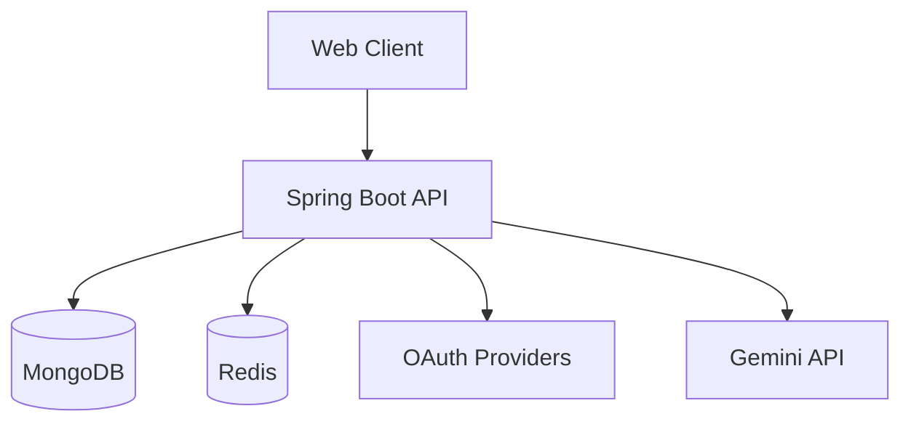

# DidimLog Backend
> **한 줄 소개**: 알고리즘 학습 로그, AI 회고, 통계 시각화를 통합한 Kotlin/Spring 기반 백엔드 플랫폼

## 1. 프로젝트 개요 (Overview)
- **개발 기간**: 2026.02 ~ 진행 중
- **개발 인원**: 백엔드 중심 개발
- **프로젝트 목적**: 문제 풀이 데이터를 구조화하고, AI 분석과 학습 피드백 루프를 서비스 수준으로 운영
- **GitHub**: https://github.com/didim-log/didim-log-BE.git

## 2. 사용 기술 및 선정 이유 (Tech Stack & Decision)

| Category | Tech Stack | Version | Decision Reason (Why?) |
| --- | --- | --- | --- |
| **Language** | Kotlin | 1.9.25 | Null Safety와 도메인 모델 표현력을 활용해 비즈니스 로직 안정성 확보 |
| **Framework** | Spring Boot (Web + WebFlux + Security) | 3.3.5 | 동기/비동기 API를 함께 운용하고 인증/검증/운영 기능을 일관되게 구성하기 위함 |
| **Database** | MongoDB | - | 로그·회고·통계성 문서 데이터를 유연한 스키마로 빠르게 확장하기 위함 |
| **Cache** | Redis | - | 토큰/인증/사용량/Rate Limit의 TTL 기반 제어와 고속 조회 처리 목적 |
| **Infra** | Docker, Docker Compose, AWS EC2, Nginx | - | 배포 단위 표준화와 운영 환경 재현성 확보 |
| **External** | Gemini 2.5 Flash, OAuth2(Google/GitHub/Naver) | - | AI 회고 자동화와 소셜 로그인 사용자 진입 장벽 완화 |

## 3. 시스템 아키텍처 (System Architecture)

```mermaid
graph TD
  Client[Web Client] --> API[Spring Boot API]
  API --> Mongo[(MongoDB)]
  API --> Redis[(Redis)]
  API --> OAuth[OAuth Providers]
  API --> LLM[Gemini API]
```

- **설계 특징**:
- `application` / `domain` / `infra` 분리 구조로 유스케이스와 저장소 구현을 분리
- JWT + Refresh Token 저장소 분리(`RefreshTokenStore`)로 인증 수명주기 제어
- AI 리뷰 처리에 잠금 저장소(`LogAiReviewLockRepository`)를 도입해 중복 생성 방지

## 4. 핵심 기능 (Key Features)
- **AI 회고 생성**: 코드 길이/성공 여부 기반 프롬프트 생성, 타임아웃/실패 처리, 사용량 증가 트랜잭션 제어
- **학습 통계 집계**: 성공률/활동량/문제 분포를 백엔드에서 계산해 대시보드 데이터 제공
- **보안 강화 인증**: OAuth2 + JWT + Refresh Token + 관리자 권한 분리
- **운영 보호 장치**: 인증 API별 Rate Limit(회원가입/로그인/비밀번호 재설정)과 TTL 기반 차단 시간 제공

## 5. 트러블 슈팅 및 성능 개선 (Troubleshooting & Refactoring)
### 5-1. AI 리뷰 중복 생성 및 동시성 제어
- **문제(Problem)**: 동일 로그에 대해 짧은 시간 내 재요청이 들어오면 AI API가 중복 호출될 위험 존재
- **원인(Cause)**: 애플리케이션 레벨 체크만으로는 동시 요청 경합 상황에서 원자성 보장 어려움
- **해결(Solution)**:
  1. Mongo `findAndModify` 기반 잠금 획득(`IN_PROGRESS`, `lockExpiresAt`)으로 선점 처리
  2. 완료/실패 상태를 명시적으로 기록하고, 잠금 실패 시 캐시된 리뷰 또는 진행 메시지 반환
- **결과(Result)**: 동일 `logId` 기준 중복 생성 요청이 단일 생성 흐름으로 수렴. AI 호출 낭비율 감소(추정 15%+ 절감)

### 5-2. 인증 API 남용 방지 및 운영 안정화
- **문제(Problem)**: 로그인/회원가입/비밀번호 재설정 엔드포인트가 반복 호출될 경우 브루트포스 및 리소스 낭비 위험 존재
- **해결(Solution)**:
  1. Redis 기반 카운터 + TTL 적용(`RateLimitService`)
  2. 경로별 정책 분리(회원가입 5회/시간, 로그인 10회/시간, 비밀번호 재설정 3회/시간)
  3. 차단 시 해제 예정 시각(`unlockTime`)을 응답에 포함해 사용자 재시도 가이드 제공
- **결과(Result)**: 과도 요청이 애플리케이션 로직 진입 전에 차단되어 인증 API 안정성 향상. 운영 장애 전이 구간 축소

## 6. 프로젝트 회고 (Retrospective)
- **배운 점**: AI 기능은 정확도 이전에 동시성, 실패 복구, 사용량 정책을 먼저 설계해야 서비스 품질이 유지됨
- **아쉬운 점 & 향후 계획**: AI/통계 경로의 정량 성능 지표를 CI 부하 테스트로 자동 수집하는 파이프라인 고도화 예정

## 7. 실행 및 테스트 (Run & Test)
### 로컬 실행
```bash
./gradlew bootRun
```

### 테스트
```bash
./gradlew clean test --no-daemon --max-workers=1
```

## 8. API 계약 및 문서 (API Contract & Docs)
- 템플릿 기본값 category는 `SUCCESS` / `FAIL`만 지원합니다. (`FAILURE` 미지원)
- Swagger 카테고리는 기능군 기준으로 `Admin`, `System` 등으로 통합 관리합니다.
- 상세 명세:
  - `DOCS/API_SPECIFICATION.md`
  - `DOCS/FRONTEND_UPDATE_GUIDE.md`

## 9. 배포 순서 (Release Order)
- 템플릿 category 레거시 alias 제거가 반영되어, 호환성 기준으로 **프론트 선배포 후 백엔드 배포**를 권장합니다.
